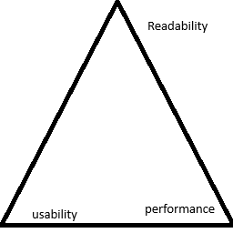
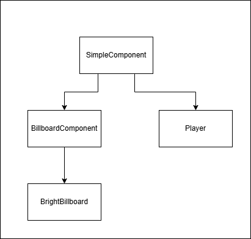
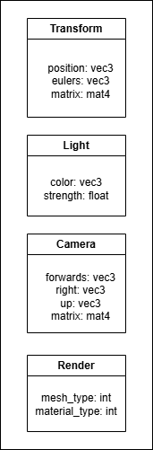
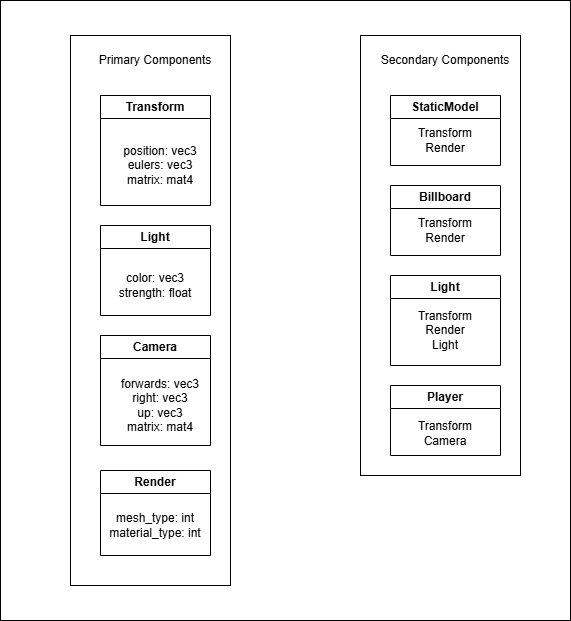

# Composition of Objects
As our project grows, it's a good idea to be frequently refactoring our code. Sometimes I'll do this in between tutorials, however occasionally the refactor will be conceptually important enough to warrant its own tutorial, that's what today's tutorial is about.

## Commonalities
Consider the objects we have so far:

- SimpleComponent
- BillboardComponent
- BrightBillboard
- Player

The class names could do with a rewrite, but beyond this, a lot of these classes share common behaviour. Looking at their code confirms this, a lot of copy pasting has gone on. No system is perfect, if a perfect system existed then that's the only thing anyone would use. The truth is that system design is also a logistics problem where a balance is struck between readability, performance and usability.



If we were to simply copy-paste code the performance would be pretty good, and it's up to you whether this improves readability or not, but the usabiility would suffer. If I make a new type of object, there has to be a better way than simply copy-pasting an existing class and reading the 99% of unchanged code to identify the 1% unique to this class.

An alternate approach could be to make an inheritance heirarchy.



This improves readability and usability, at the cost of performance. Under the hood, lookup tables are created. If I want to access a BrightBillboard's position variable, that's stored in its SimpleComponent superclass, and two levels of indirection are followed to access it. Inheritance can be acceptible for wide yet shallow hierarchies, where not many lookups are involved. As a matter of a fact the dirty truth is that inheritance is ok for most indie games. It's just fun to try out different approaches.

Another approach is to look at the variables in the classes and group them into "components", individual bundles of data used for specific functionality.



Normally I would then go down the full data oriented approach: store all the components together in arrays, regardless of which object they correspond to. This definitely has benefits to performance, if we can deal with numpy arrays then a lot of avenues open up for quick data processing. I'd even make the argument that once a solid system is in place, usability is pretty good. However, it might be a bit much for beginners or programmers who aren't ready to dive into data oriented programming. The approach I'm using in this tutorial is to bundle those components together in the game objects themselves. Just like primary colors are mixed together to make the range of visible colors, primary components are mixed together to make the objects of our game world.



This isn't a perfect system, for example both the Billboard and Light will need to rotate to face the player, and currently that is accomplished by duplicated code. This compromise was made in order to limit the depth of lookups. The Camera component demonstrates an approach which could solve this. The Camera component is not a standalone component, without a transform component the lookat matrix cannot be built as the camera component won't know the camera's position. How can we solve this without extending the depth of the hierarchy? In my solution, the camera component accepts a position and rotation in its update method. These are simple data types, not tied to any idea of a component.

```
def update(self, position: np.ndarray, eulers: np.ndarray) -> None:
    """
        Calculate the lookat matrix of the camera.

        Parameters:

            position: where to look from

            eulers: rotation of camera
    """

    self.forwards[0] = np.cos(eulers[2]) * np.cos(eulers[1])
    self.forwards[1] = np.sin(eulers[2]) * np.cos(eulers[1])
    self.forwards[2] = np.sin(eulers[1])

    right = np.cross(self.forwards, self.global_up)

    up = np.cross(right, self.forwards)

    self.matrix = pyrr.matrix44.create_look_at(
        eye = position,
        target = position + self.forwards,
        up = up, 
        dtype = np.float32
    )
```

Then when the player updates it fetches the info from its Transform Component, and instructs its Camera Component to update, limiting the depth of lookups to one.

```
def update(self):

    self.camera.update(self.transform.position, self.transform.eulers)
```

## Type Casting
That's the basic pattern! Code is provided for you to peruse at your leisure. There's just one addendum to add, it can be useful to tell Python what data type you expect a variable to be. This enables code completion.

Say for instance I'm rendering objects, this involves looking through a collection of game objects and fetching their Transform and Render Components.

```
for obj in scene.lit_objects:
    render_component = obj.render
    mesh_type = render_component.mesh_type
    material_type = render_component.material_type - WOOD_MATERIAL
    transform_component = obj.transform
    model_matrix = transform_component.matrix
    # ...
```

When it comes to grabbing the data from those components, there's a good chance the linter will give up on suggesting anything. This is easily fixed with inline type hints.

```
for obj in scene.lit_objects:
    render_component: model.RenderComponent = obj.render
    mesh_type = render_component.mesh_type
    material_type = render_component.material_type - WOOD_MATERIAL
    transform_component: model.TransformComponent = obj.transform
    model_matrix = transform_component.matrix
    # ...
```

And there we have it! Game development is not a direct line, as you learn more it's important to be revisiting your codebase and experimenting with different approaches. Have fun!