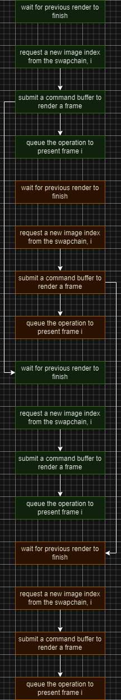
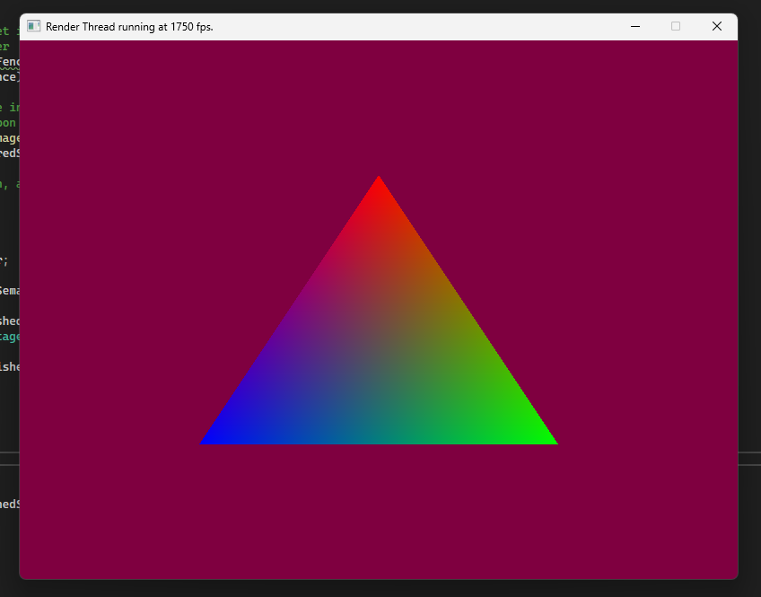

# Frames in Flight
You may recall that in the previous installment of this series, I implemented a novel multithreaded work submission system. As much as I would have loved to persist with it, there are too many issues.
* If something goes wrong during rendering, a robust system will flush out the graphics queue then rebuild any outdated resources. The multithreaded system is too fragile to handle this elegantly.
* In theory, spacing out the tasks should increase the throughput, but in practice it's choking the graphics queue with non-useful work (eg. rendering two frames before either of them get presented.)

For these reasons I'm simplifying the rendering code, for now. This session will follow on from part 12: synchronisation.

## What's wrong with the way things are currently being done?
Nothing, really, the current approach to rendering is:


Here arrows show the synchronization dependencies. The issue is not immediately apparent, but may make a little more sense if we look at two consecutive draws.


Consider the distance between command queue submissions and the fence between them. In the time between the GPU finishing its last render and getting the work for its next job, it may sit idle. Again, there's nothing inherently wrong with this. If the framerate of the game is limited then it might not even be noticeable, but in the spirit of "number go up", we can improve it.

## Frames in Flight
The frames in flight flight technique sits somewhere between the naive method and a fully multithreaded approach. We feed work to the GPU in a serial manner, but interleaved. Imagine two virtual frames named A and B, the idea is that we submit everything for frame A, and then while the GPU works in the background we submit everything we need to render frame B.



This is gentler than multithreading because the rate of feeding in new work in serial, but it reduces the probability that the GPU will stall waiting for itself. The process of feeding in work can be halted at any point without worrying about race conditions with other threads, and the amount of useful work is increased. So how do we implement this? It's surprisingly simple.

## What is a frame?
One refactor we're going to need is to rethink the definition of what a "frame" is in our engine. Previously I've been using frames as a catch-all, associating a swapchain image, command buffer etc. with each frame. This has caused some weird workarounds and can be remedied with a new definition: a frame is a set of all the state and synchronisation structures needed to render a frame. This means that frames will need to re-record their command buffers each frame, but that's not a big deal.

To start with, let's change the constructor and member variables for a frame.

<src/renderer/frame.h:>
```
public:
Frame(Swapchain& swapchain, 
    vk::CommandBuffer commandBuffer,
    std::vector<vk::ShaderEXT>& shaders,
    vk::DispatchLoaderDynamic& dl);

Swapchain& swapchain;

vk::CommandBuffer commandBuffer;

std::vector<vk::ShaderEXT>& shaders;

vk::DispatchLoaderDynamic& dl;
```

The constructor is pretty much what it looks like, all references are captured in the initializer list.
```
Frame::Frame(Swapchain& swapchain,
	vk::CommandBuffer commandBuffer,
	std::vector<vk::ShaderEXT>& shaders,
	vk::DispatchLoaderDynamic& dl): swapchain(swapchain), shaders(shaders), dl(dl) {
    
	this->commandBuffer = commandBuffer;
}
```

In the Engine's initializer, frames are first being built and then their command buffers are being set. This can be greatly simplified.

```
Engine::Engine(GLFWwindow* window) :
	window(window) {

	// ...

	commandPool = make_command_pool(logicalDevice, graphicsQueueFamilyIndex,
		deviceDeletionQueue);

	for (uint32_t i = 0; i < 2; ++i) {
		vk::CommandBuffer commandBuffer = allocate_command_buffer(logicalDevice, commandPool);
		frames.push_back(Frame(swapchain, commandBuffer, shaders, dldi));
	}

	// ...
}
```

## Swapchain Resource Supremacy
If a frame is all the context needed to draw a frame, then a swapchain is all the data needed to define a draw target. In other words, let's make the swapchain class manage its images and image views. We can start by declaring public member variables to hold the resources.

<src/renderer/swapchain.h>:
```
class Swapchain {
public:

    std::vector<vk::Image> images;

    std::vector<vk::ImageView> imageViews;

    // ...
}
```

The images can be fetched and views constructed in the constructor.

```
// ...
#include "image.h"

void Swapchain::build(
    vk::Device logicalDevice, vk::PhysicalDevice physicalDevice, 
    vk::SurfaceKHR surface, uint32_t width, uint32_t height,
    std::deque<std::function<void(vk::Device)>>& deviceDeletionQueue) {

    // ...

    images = logicalDevice.getSwapchainImagesKHR(chain).value;

    for (uint32_t i = 0; i < images.size(); ++i) {
        vk::ImageView imageView = create_image_view(logicalDevice, images[i], format.format);
        imageViews.push_back(imageView);
        VkImageView imageViewHandle = imageView;
        deviceDeletionQueue.push_back([imageViewHandle](vk::Device device) {
            vkDestroyImageView(device, imageViewHandle, nullptr);
        });
    }
}
```

## Coupling the Frames to the Swapchain
Each frame has a reference to the swapchain, so all we need is to pass an image index when it comes time to render. The process goes something like this:

* Acquire a swapchain image, the function immediately returns the image index, while in the background the GPU prepares the image for rendering.
* Tell the current frame to record commands to render to the given image index
* Go through the normal work of rendering and presenting

The frame's methods will need slight modification to achieve this.

```
class Frame {
public:

    // ...

    void record_command_buffer(uint32_t imageIndex);

private:

    void build_rendering_info();

    void build_color_attachment(uint32_t imageIndex);

    void annoying_boilerplate_that_dynamic_rendering_was_meant_to_spare_us();

    // ...

};
```
A lot of the alterations to the source file are minor edits.

The rendering code then looks like this:
```
void Engine::draw() {

	//Wait for a possible render operation, then reset it so
	// that it can be signalled by this frame's render
	logicalDevice.waitForFences(renderFinishedFence, false, UINT64_MAX);
	logicalDevice.resetFences(renderFinishedFence);

	//Send an asynchronous fetch request for an image index on the swapchain,
	// the imageAquiredSemaphore will be signalled upon completion
	uint32_t imageIndex = logicalDevice.acquireNextImageKHR(
		swapchain.chain, UINT64_MAX, imageAquiredSemaphore, nullptr).value;

	//Graphics operations! Wait upon image aquisition, and signal 
	// the renderFinishedSemaphore upon completion
	frames[0].record_command_buffer(imageIndex);
	vk::SubmitInfo submitInfo = {};
	submitInfo.commandBufferCount = 1;
	submitInfo.pCommandBuffers = &frames[0].commandBuffer;
	submitInfo.waitSemaphoreCount = 1;
	submitInfo.pWaitSemaphores = &imageAquiredSemaphore;
	submitInfo.signalSemaphoreCount = 1;
	submitInfo.pSignalSemaphores = &renderFinishedSemaphore;
	vk::PipelineStageFlags waitStage = vk::PipelineStageFlagBits::eColorAttachmentOutput;
	submitInfo.pWaitDstStageMask = &waitStage;
	graphicsQueue.submit(submitInfo, renderFinishedFence);

	//Queue the swapchain image up for presentation, 
	// wait on the previous render operation
	vk::PresentInfoKHR presentInfo = {};
	presentInfo.swapchainCount = 1;
	presentInfo.pSwapchains = &swapchain.chain;
	presentInfo.pImageIndices = &imageIndex;
	presentInfo.waitSemaphoreCount = 1;
	presentInfo.pWaitSemaphores = &renderFinishedSemaphore;

	graphicsQueue.presentKHR(presentInfo);
}
```

Very minimal change here, we're hardcoding it to just render with one frame, for now.


*I love a triangle*

## Frames in Flight
Ok, for real this time. Create and store the synchronization objects in the frame class.
```
#pragma once
#define VULKAN_HPP_NO_EXCEPTIONS
#include <vulkan/vulkan.hpp>
#include "image.h"
#include "swapchain.h"
#include <deque>
#include <functional>

/**
 * @brief Holds all the state used in one
 *  rendering/presentation operation.
 * 
 */
class Frame {
public:

    // ...

    vk::Semaphore imageAquiredSemaphore;

    vk::Semaphore renderFinishedSemaphore;

    vk::Fence renderFinishedFence;

private:

    // ...

};
```
```
#include "frame.h"
#include "image.h"
#include "synchronisation.h"

Frame::Frame(vk::Device& logicalDevice,
	Swapchain& swapchain,
	vk::CommandBuffer commandBuffer,
	std::vector<vk::ShaderEXT>& shaders,
	vk::DispatchLoaderDynamic& dl,
	std::deque<std::function<void(vk::Device)>>& deviceDeletionQueue): swapchain(swapchain), shaders(shaders), dl(dl) {
    
	this->commandBuffer = commandBuffer;

	imageAquiredSemaphore = make_semaphore(logicalDevice, deviceDeletionQueue);
	renderFinishedSemaphore = make_semaphore(logicalDevice, deviceDeletionQueue);
	renderFinishedFence = make_fence(logicalDevice, deviceDeletionQueue);
}
// ...
```

We'll remove the objects from the renderer, but give it a variable to track which frame context to call on next.
```
class Renderer {
    // ...
private:
    // ...

    uint32_t frameIndex = 0;
}
```

Finally we adjust the rendering code to use the frame's synchronisation structures.

```
void Engine::draw() {

	Frame& frame = frames[frameIndex];

	//Wait for a possible render operation, then reset it so
	// that it can be signalled by this frame's render
	logicalDevice.waitForFences(frame.renderFinishedFence, false, UINT64_MAX);
	logicalDevice.resetFences(frame.renderFinishedFence);

	//Send an asynchronous fetch request for an image index on the swapchain,
	// the imageAquiredSemaphore will be signalled upon completion
	uint32_t imageIndex = logicalDevice.acquireNextImageKHR(
		swapchain.chain, UINT64_MAX, frame.imageAquiredSemaphore, nullptr).value;

	//Graphics operations! Wait upon image aquisition, and signal 
	// the renderFinishedSemaphore upon completion
	frame.record_command_buffer(imageIndex);
	vk::SubmitInfo submitInfo = {};
	submitInfo.commandBufferCount = 1;
	submitInfo.pCommandBuffers = &frame.commandBuffer;
	submitInfo.waitSemaphoreCount = 1;
	submitInfo.pWaitSemaphores = &frame.imageAquiredSemaphore;
	submitInfo.signalSemaphoreCount = 1;
	submitInfo.pSignalSemaphores = &frame.renderFinishedSemaphore;
	vk::PipelineStageFlags waitStage = vk::PipelineStageFlagBits::eColorAttachmentOutput;
	submitInfo.pWaitDstStageMask = &waitStage;
	graphicsQueue.submit(submitInfo, frame.renderFinishedFence);

	//Queue the swapchain image up for presentation, 
	// wait on the previous render operation
	vk::PresentInfoKHR presentInfo = {};
	presentInfo.swapchainCount = 1;
	presentInfo.pSwapchains = &swapchain.chain;
	presentInfo.pImageIndices = &imageIndex;
	presentInfo.waitSemaphoreCount = 1;
	presentInfo.pWaitSemaphores = &frame.renderFinishedSemaphore;

	graphicsQueue.presentKHR(presentInfo);

	frameIndex = frameIndex ^ 1;
}
```


*It's a little bit faster*

Your mileage may vary with this technique, but hopefully you're now confident with it, as well as the abstractions used.