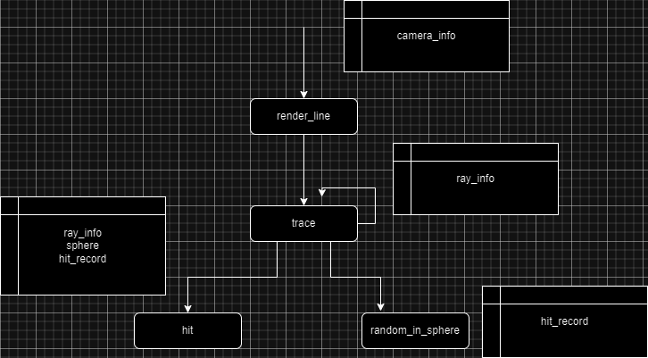
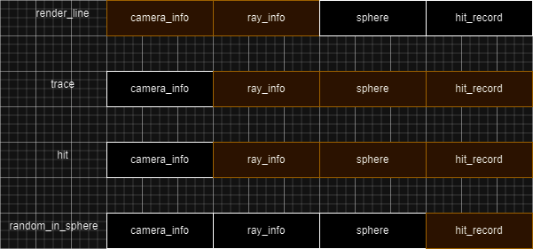

# Profiling Python Code
Python is slow, this much is known. However a fair deal less is known about how to speed it up, that's the focus of this session. After all, if we're going to get into Data Oriented Design, we'll need to get comfortable with low level programming. Let's go!

## Video

## Running cProfile
Take some time to read through the naive raytracer listing. It's a pretty standard implementation inspired by [Ray Tracing in One Weekend](https://raytracing.github.io/books/RayTracingInOneWeekend.html).

Rendering with 8 samples per pixel and up to 8 bounces per ray gives:
```
Render took 13.892452478408813 seconds
```

Can we make it faster? Usually this is done through trial and error and exerience. In fact we'll be applying all of those, but profiling tools are also a good place to start. cProfile is a (relatively) low overhead profiler which intercepts all function calls and times them. We can implement it in a separate file like this:

```
from cProfile import Profile
from pstats import SortKey, Stats
import naive_raytracer as raytracer

with Profile() as profile:
    raytracer.main_loop()
    Stats(profile).strip_dirs().sort_stats(SortKey.TIME).print_stats()
```

Running this gives the following stats:

```
ncalls  tottime  percall  cumtime  percall filename:lineno(function)
 11544351    7.982    0.000    7.982    0.000 naive_raytracer.py:102(hit)
3851740/2457600    7.141    0.000   20.150    0.000 naive_raytracer.py:58(trace)
      480    3.384    0.007   25.371    0.053 naive_raytracer.py:31(render_line)
  9097620    1.781    0.000    2.626    0.000 random.py:494(uniform)
  1394140    1.675    0.000    3.658    0.000 naive_raytracer.py:159(random_in_unit_sphere)
     5029    1.085    0.000    1.085    0.000 {built-in method pygame.pixelcopy.array_to_surface}
  9097620    0.845    0.000    0.845    0.000 {method 'random' of '_random.Random' objects}
  5080540    0.733    0.000    0.733    0.000 {built-in method builtins.max}
     5029    0.645    0.000    0.645    0.000 {built-in method pygame.display.flip}
  4773340    0.627    0.000    0.627    0.000 {built-in method builtins.min}
  4182420    0.486    0.000    0.486    0.000 {built-in method math.cos}
  3848118    0.334    0.000    0.334    0.000 {built-in method builtins.len}
  2788280    0.309    0.000    0.309    0.000 {built-in method math.sin}
     5029    0.134    0.000    0.134    0.000 {built-in method pygame.display.set_caption}
     5029    0.134    0.000    0.134    0.000 {built-in method pygame.event.get}
        1    0.076    0.076    0.076    0.076 {built-in method pygame.base.quit}
   307200    0.074    0.000    0.074    0.000 {method 'map_rgb' of 'pygame.surface.Surface' objects}
        1    0.025    0.025   27.489   27.489 naive_raytracer.py:172(main_loop)
     5029    0.013    0.000    1.099    0.000 surfarray.py:96(blit_array)
     5029    0.004    0.000    0.004    0.000 {method 'tick' of 'pygame.time.Clock' objects}
     5029    0.001    0.000    0.001    0.000 {method 'get_fps' of 'pygame.time.Clock' objects}
     5030    0.001    0.000    0.001    0.000 {built-in method builtins.isinstance}
        1    0.000    0.000    0.000    0.000 {built-in method builtins.print}
        1    0.000    0.000    0.000    0.000 {method 'disable' of '_lsprof.Profiler' objects}
        1    0.000    0.000    0.000    0.000 pstats.py:108(__init__)
        1    0.000    0.000    0.000    0.000 pstats.py:137(load_stats)
        1    0.000    0.000    0.000    0.000 pstats.py:118(init)
        2    0.000    0.000    0.000    0.000 {built-in method time.time}
        1    0.000    0.000    0.000    0.000 cProfile.py:52(create_stats)
        1    0.000    0.000    0.000    0.000 {built-in method builtins.hasattr}
```

Some observations:

- Hit, Trace, and Render Line are the "hottest" functions (in that order). Any change made to these should have the greatest effect on the program.
- Random's Uniform distribution is up there too. Is there a faster way to get a random float?
- Built in functions such as min, max, sin, cos and len. Reconsider their usage.
- Other functions seem to mostly be necessary.

## Optimizing Intersection Tests
Here is the code for ray-sphere intersection, notice anything?
```
def hit(ray_position, ray_direction, sphere, t_min, t_max, render_state, debug):
        
    center = sphere[0:3]
    radius = sphere[3]
    color = sphere[4:7]

    co = [
        ray_position[0] - center[0],
        ray_position[1] - center[1],
        ray_position[2] - center[2]]
    a = ray_direction[0] * ray_direction[0] \
        + ray_direction[1] * ray_direction[1] \
        + ray_direction[2] * ray_direction[2]
    b = 2 * (co[0] * ray_direction[0] 
                + co[1] * ray_direction[1] 
                + co[2] * ray_direction[2])
    c = (co[0] * co[0] + co[1] * co[1] + co[2] * co[2]) - radius * radius
    discriminant = b * b - 4 * a * c
    #if debug:
    #    print(discriminant)
    if discriminant < 0:
        return False
    root = (-b - (discriminant) ** 0.5) / (2 * a)
    if (root < t_min) or (root > t_max):
        root = (-b + (discriminant) ** 0.5) / (2 * a)
        if (root < t_min) or (root > t_max):
            return False
    
    #pos, normal, t, color
    pos = [
        ray_position[0] + root * ray_direction[0],
        ray_position[1] + root * ray_direction[1],
        ray_position[2] + root * ray_direction[2]
    ]
    render_state[0:3] = pos[:]

    displacement = [
        pos[0] - center[0],
        pos[1] - center[1],
        pos[2] - center[2]
    ]
    displacement_magnitude = (displacement[0] * displacement[0] 
                                + displacement[1] * displacement[1] 
                                + displacement[2] * displacement[2]) ** 0.5
    
    displacement[0] = displacement[0] / displacement_magnitude
    displacement[1] = displacement[1] / displacement_magnitude
    displacement[2] = displacement[2] / displacement_magnitude

    render_state[3:6] = displacement[:]

    render_state[6] = root
    
    render_state[7:10] = color

    return True
```

There's a debug parameter which isn't being used, but otherwise things seem pretty tight. The only issue here is list slicing. List slicing is convenient, but has some overhead. Given that it's literally only there to save typing out more lines, we can remove it. We can also remove that weird extra if statement for when root is out of bounds.

```
Render took 12.306018829345703 seconds
```

## Optimizing Ray Trace
Here is the code for trace:

```
def trace(ray_position, ray_direction, spheres, bounce):

    alpha = min(1.0, max(0.0, ray_direction[1]))

    color = [1 - alpha, 1 - alpha, 1]
    
    if bounce >= bounces:
        return color

    #pos, normal, t, color
    render_state = [0,0,0,0,0,0,0,0,0,0]
    nearest_hit = 1e30
    hit_something = False
    sphere_count = len(spheres) // 7
    for i in range(sphere_count):
        sphere = spheres[7 * i : 7 * i + 7]
        if hit(ray_position, ray_direction, sphere, 0.001, nearest_hit, render_state):
            nearest_hit = render_state[6]
            hit_something = True
        
    if hit_something:
        ray_position[:] = render_state[0:3]

        deflection = random_in_unit_sphere()
        normal = [
            render_state[3] + deflection[0],
            render_state[4] + deflection[1],
            render_state[5] + deflection[2]
        ]
        normal_magnitude = (
             normal[0] * normal[0] 
             + normal[1] * normal[1] 
             + normal[2] * normal[2]) ** 0.5
        ray_direction[0] = normal[0] / normal_magnitude
        ray_direction[1] = normal[1] / normal_magnitude
        ray_direction[2] = normal[2] / normal_magnitude

        new_color = trace(ray_position, ray_direction, spheres, bounce + 1)

        color[0] = render_state[7] * new_color[0]
        color[1] = render_state[8] * new_color[1]
        color[2] = render_state[9] * new_color[2]
    return color
```

There's a whole lot of issues here:
- clamping the color value may not be necessary, remove the min and max.
- why do we need to get the number of spheres for each trace of each ray? Fetch this variable at program data creation.
- more list slicing, remove it.
- while we're at it, what is even the point of dividing by seven at definition time and then multiplying by 7 at runtime? Just make the loop increment by seven each time. Every seven floats on the list define all the data for one sphere.
- the near distance for the ray is a constant value, let's hard code it in the intersection test instead.

```
Render took 11.548754215240479 seconds
```

## Optimizing Render Line
Here is the code for render_line, notice anything odd?

```
for screen_x in range(screen_width):
        
    #set up for trace
    color = [0,0,0]
    largest_dimension = max(screen_width/2, screen_height/2)
    for sample in range(samples):
        horizontal_coefficient = (screen_x + random.uniform(0.0, 1.0) - screen_width / 2) / largest_dimension
        vertical_coefficient = (screen_y + random.uniform(0.0, 1.0) - screen_height / 2) / largest_dimension
        ray_position = [
            camera_pos[0], camera_pos[1], camera_pos[2]]
        ray_direction = [
            camera_forwards[0] + horizontal_coefficient * camera_right[0] + vertical_coefficient * camera_up[0],
            camera_forwards[1] + horizontal_coefficient * camera_right[1] + vertical_coefficient * camera_up[1],
            camera_forwards[2] + horizontal_coefficient * camera_right[2] + vertical_coefficient * camera_up[2]]
        new_color = trace(ray_position, ray_direction, spheres, 0)
        color[0] += new_color[0]
        color[1] += new_color[1]
        color[2] += new_color[2]

    r = max(0,min(255,int(color[0] * 255 / samples)))
    g = max(0,min(255,int(color[1] * 255 / samples)))
    b = max(0,min(255,int(color[2] * 255 / samples)))

    screen_pixels[screen_x][screen_y] = screen.map_rgb((r,g,b))
```

It's not a big function, but it has a big issue. Horizontal and Vertical coefficients for the ray are being recalculated for each sample, whereas the only thing which changes about them is their random variation! Let's fix this, and also adjust the capping on the r,g,b values.

```
Render took 11.369472980499268 seconds
```

## Optimizing Sin and Cos
We could try optimizing the trig by mathematical identities, but in Python it isn't worth the CPU time to do the maths. One thing we can do is make sure we're only calling trig functions once and reusing results.

```
Render took 11.066004514694214 seconds
```

## Optimizing Random Floats
Turns out random.random() is faster.

```
Render took 10.746646642684937 seconds
```

## Magic
cProfile will time function execution, but it won't tell us much about memory access. For that I'll pull out a little trick. Let's analyse a typical trace of our program:



It seems to be that common data is being passed around. Let's imagine sticking all this data together into a single list, and passing that object around instead. The list will be arranged so that data is spatially close within the list when needed.



Let me be clear, this is fun but slight overkill. The code listing is available if you'd like to see it.

```
Render took 8.730186462402344 seconds
```

The purpose of this video is not to rant about a specific example, but rather to show that performance without metrics is little more than guesswork. As we learn more about Data Oriented Design together, it will be important to keep this spirit of investigation alive and healthy. But that's enough for now, happy coding!