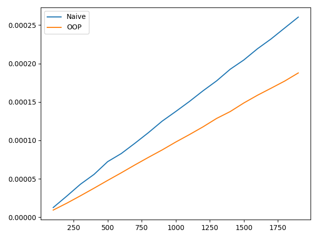
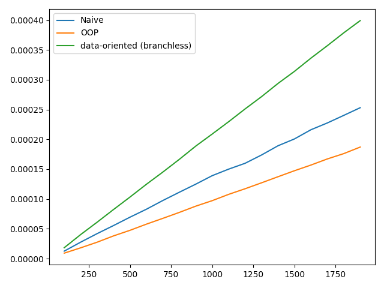
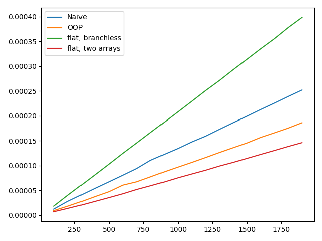
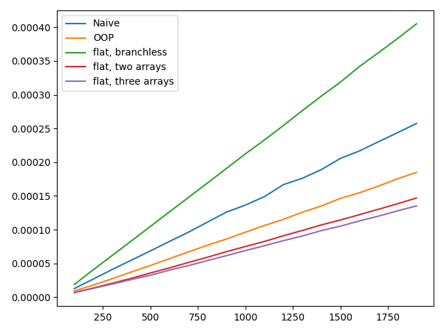

# Proto-Data Oriented Design
Back when I was learning to program for the first time I made my own 3D renderer. Not knowing about object oriented programming, I stored all my data on a single list.


Objects were stored randomly, every entry started with a code indicating its type, followed by a payload of data. When stepping through the list, the program could choose to either work on the payload or skip it, based on the object code and what action was being taken. 

Now anyone versed in Object Oriented Programming will say this is the wrong way to organise a program, but is that true? The answer is yes, but the more interesting question is: what's wrong with it? Let's simulate it with a simple example, imagine we have two object codes: zero and one. Objects with code zero have a single number in their payload, objects with code one have two.

```
x = []
for i in range(n[j]):
    object_code = np.random.randint(0,2)
    x.append(object_code)
    x.append(np.random.random())
    if object_code == 1:
        x.append(np.random.random())

# [0, 0.2, 1, 0.2, 0.3, 1, 0.4, 0.5, 0, 0.6, ...]
```

When processing, objects with code 0 double their data, whereas object with code 1 update by adding their two numbers together and storing the result in the first number of their payload.

```
while i < len(x):
    object_code = x[i]
    i += 1
    
    if object_code == 0:
        x[i] = 2 * x[i]
        i += 1
    else:
        x[i] = x[i] + x[i + 1]
        i += 2
```

For comparison, we can implement a similar naive example with object oriented programming, first we can define classes which do the same thing:

```
class Object0:

    def __init__(self, a):
        self._a = a
    
    def update(self):
        self._a = self._a * 2

class Object1:

    def __init__(self, a, b):
        self._a = a
        self._b = b
    
    def update(self):
        self._a = self._a + self._b
```

Then as before, populate a list of these objects

```
for i in range(n[j]):
    object_code = np.random.randint(0,2)
    
    if object_code == 0:
        x.append(Object0(np.random.random()))
    else:
        x.append(Object1(np.random.random(), np.random.random()))
```

And update, simple!

```
for i in range(len(x)):
    x[i].update()
```

How do these methods compare to each other?



Clearly the object oriented approach is outperforming a completely naive approach, so what's wrong with the naive approach?

## Branch Prediction
The short answer is the naive approach was almost designed to have as many problems as possible, but believe it or not I really used to program like this! One issue is branch prediction.


CPU instructions are fairly complex, and clock speeds are limited. In order to improve instruction throughput, modern CPUs have something called instruction pipelining. By decomposing complex instructions into subtasks, which all work sequentially in lockstep, individual stages do more work. This works well when the flow of execution is deterministic, ie. there are no if statements. In the case of an if statement, the entire instruction pipeline must be flushed and restarted, stalling the CPU.

Let's declare the update functions separately.
```
def update_0(x, i):
    x[i] = 2 * x[i]
    return i + 1

def update_1(x, i):
    x[i] = x[i] + x[i + 1]
    return i + 2

update = [update_0, update_1]
```

Putting function references into a list means we can use the object code to select the appropriate function without a branch. Now let's update the objects:

```
while i < len(x):
    object_code = x[i]
    i += 1
    
    i = update[object_code](x, i)
```



Woo yeah! Branchless programming for the win!

## Systems: do one thing.
I was hoping the branchless approach would perform better, but the honest fact is the data is bad. Here's an alternate approach: lets store the objects in two arrays, and process each array separately. This not only removes branching but also removing the object code from the arrays will improve the memory layout by removing redundant data.

Declare the arrays:
```
x = []
y = []
for i in range(n[j]):
    object_code = int(np.random.randint(0,2))
    if object_code == 0:
        x.append(np.random.random())
    if object_code == 1:
        y.append(np.random.random())
        y.append(np.random.random())
```

and update:
```
for i in range(len(x)):
    x[i] = 2 * x[i]
    
for i in range(0, len(y), 2):
    y[i] = y[i] + y[i + 1]
```



Excellent, we've beaten OOP! Can we do better?



Splitting the y array into two arrays seems to improve performance slightly. But we're not done here, although Python may be limited, C++ has features like SIMD and multithreading which can massively improve the processing time. In the next session we'll look at some of these. See you then!