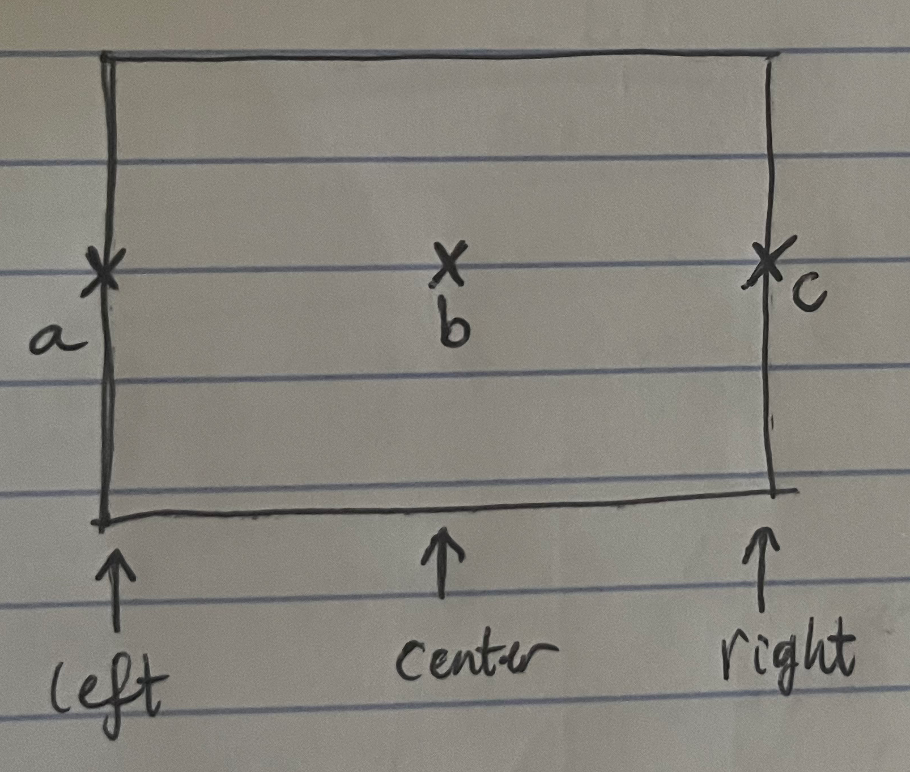
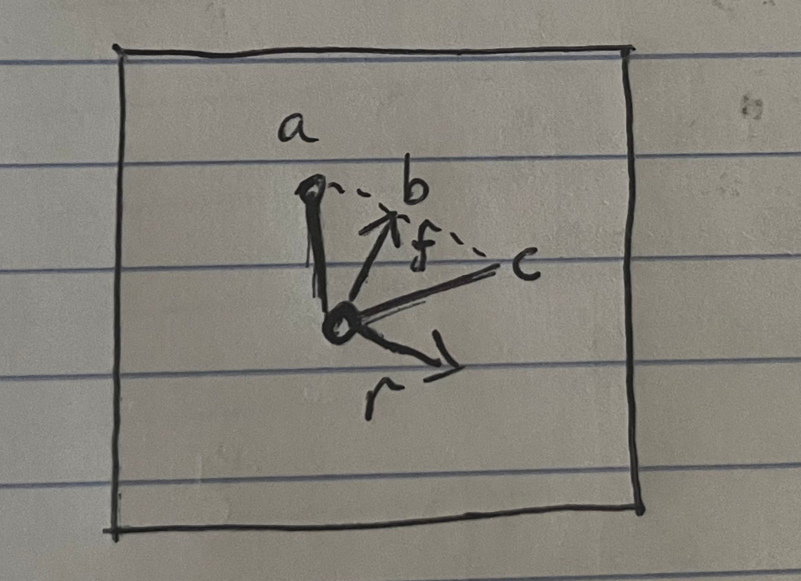
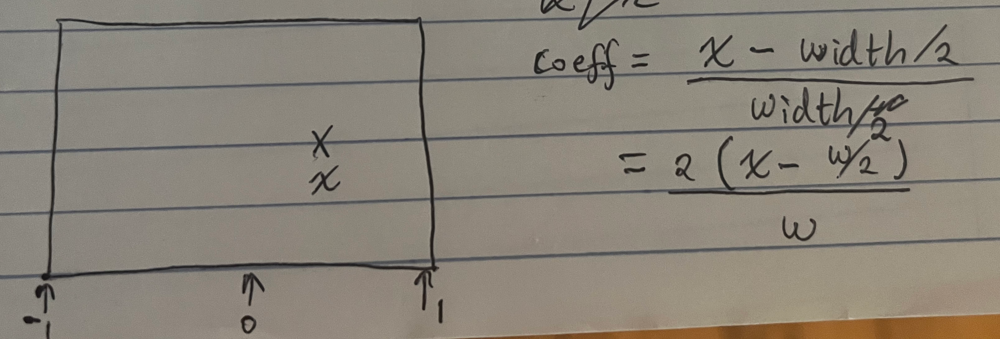

# Stage 5: Rendering the scene
Previously we looked at the DDA algorithm and used it to cast a single ray in front of us, now we'll use the algorithm to actually render our 3d scene.

## Rendering Algorithm
In order to render the screen, we'll cast a ray for each x coordinate on the screen, running from left to right.

```
def raycast_scene(camera: np.ndarray, width: int, height: int, 
                  game_map: np.ndarray, 
                  color_buffer: np.ndarray, colors: tuple[int]):
    
    for x in range(width):

        # Make a ray, coming from the player's position,
        # looking through the x coordinate

        # Cast ray out into the world, measure what it hit
        # and how far it travelled

        # draw a vertical slice of the wall
```

## Finding Ray Direction
First things first, how do we find the ray's direction?

The screen runs left to right:


This is called "screen space", but these dimensions also have a meaning in the top-down view:



We need to know how an x coordinate  on the screen corresponds to a direction in the world. From the diagram we have:
```
a = forwards - right
b = forwards
c = forwards + right
```

In other words, the world space direction vector is a linear combination of the camera's forwards and right vectors, where the coefficient of the combination is determined by the x coordinate of the screen.



Let's define a function which will give us the ray's direction.

```
def get_ray(x: int, w: int, 
            forwards: tuple[float], 
            right: tuple[float]) -> tuple[float]:
    
    coefficient = (2.0 * x - w) / float(w)

    ray_x = forwards[0] + coefficient * right[0]
    ray_y = forwards[1] + coefficient * right[1]

    return (ray_x, ray_y)
```

We can then use it in our raycast function.

```
def raycast_scene(camera: np.ndarray, width: int, height: int, 
                  game_map: np.ndarray, 
                  color_buffer: np.ndarray, colors: tuple[int]):
    
    forwards = rotate(1, 0, camera[2])
    right = rotate(0, -1, camera[2])

    for x in range(width):

        ray = get_ray(x, width, forwards, right)

        # raycast

        # render
```

## Casting the ray

We've implemented most of the raycasting already, we'll just modify the function so it returns both the distance and the tile that the ray intersects.

```
def trace(ray: tuple[float], position: tuple[float], 
          game_map: np.ndarray) -> tuple[float, int]:
    
    # trace
    map_x = int(position[0])
    map_y = int(position[1])
    dist_x = 1 / max(abs(ray[0]), 1e-10)
    dist_y = 1 / max(abs(ray[1]), 1e-10)
    proportion_from_left = position[0] - map_x
    step_x = int(np.sign(ray[0]))
    t_x = proportion_from_left * dist_x if step_x < 0 else (1.0 - proportion_from_left) * dist_x
    proportion_from_bottom = position[1] - map_y
    step_y = int(np.sign(ray[1]))
    t_y = proportion_from_bottom * dist_y if step_y < 0 else (1.0 - proportion_from_bottom) * dist_y

    tile = game_map[map_x][map_y]
    side = 0

    while tile == 0:

        # step forwards
        if t_x < t_y:
            t_x += dist_x
            map_x += step_x
            side = 0
        else:
            t_y += dist_y
            map_y += step_y
            side = 1
        
        tile = game_map[map_x][map_y]

    distance = t_x if side == 0 else t_y
    
    return (distance, tile)
```

```
def raycast_scene(camera: np.ndarray, width: int, height: int, 
                  game_map: np.ndarray, 
                  color_buffer: np.ndarray, colors: tuple[int]):
    
    forwards = rotate(1, 0, camera[2])
    right = rotate(0, -1, camera[2])
    for x in range(width):

        ray = get_ray(x, width, forwards, right)

        distance, tile = trace(ray, camera, game_map)

        # render
```

## Rendering
Walls shrink towards the horizon as they get further away. Let's draw a solid line, centered around the horizon, with the appropriate color.
```
#render

wall_height = 0.5 * height

y_top = int(max(0, int(0.5 * height - wall_height)))
y_bottom = int(min(height - 1, int(0.5 * height + wall_height)))
color = int(colors[tile + 3])

draw_vertical_line(color_buffer, color, x, y_top, y_bottom)
```

Now let's apply perspective by dividing the wall height by its distance from the camera.

```
wall_height = 0.5 * height / distance
```

Something's gone very wrong here, the issue is that rays are measuring their distance to the player, rather than their distance to the thin lens (ie, computer screen) through which the player is looking. For a rigorous explanation, see [lodev's tutorial](https://lodev.org/cgtutor/raycasting.html), but in short, we just need to adjust the final ray distance expression.

```
def trace(ray: tuple[float], position: tuple[float], 
          game_map: np.ndarray) -> tuple[float, int]:
    
    # ...

    distance = t_x - dist_x if side == 0 else t_y - dist_y
```

And there we have it! There are a few modifications we can add.

## Shading
To make the scene look less flat, we can shade blocks differently on their sides. Define a set of new colors in the palette:
```
colors = (
    # previous colors
    # ...
    self.screen_surface.map_rgb(  0,   0, 128), #color 1 (dark)
    self.screen_surface.map_rgb(128, 128,   0), #color 2 (dark)
    self.screen_surface.map_rgb(  0, 128, 128), #color 3 (dark)
    self.screen_surface.map_rgb(  0, 128,   0), #color 4 (dark)
    self.screen_surface.map_rgb(128,   0, 128), #color 5 (dark)
    self.screen_surface.map_rgb(128,   0,   0), #color 6 (dark)
    )
```

Then select one of these shaded colors in the trace function, based on whether the wall is horizontal or vertical.

```
if side == 1:
    tile += 6
```

## Reducing overdraw
Currently we draw the ceiling and floor by filling in the whole screen, then draw walls on top of that. This has some overdraw. We can assume our map will be "closed", so every x coordinate will have a vertical scanline, and the wall drawn on that line will be the closest possible wall. Therefore, when we draw the wall, we know that any space above wall_top will be ceiling, and any space below wall_bottom will be floor. We can remove the rectangle functions and handle the floor and ceiling in the main render.

```
@njit()
def raycast_scene(camera: np.ndarray, width: int, height: int, 
                  game_map: np.ndarray, 
                  color_buffer: np.ndarray, colors: tuple[int]):
    
    forwards = rotate(1, 0, camera[2])
    right = rotate(0, -1, camera[2])
    for x in range(width):

        ray = get_ray(x, width, forwards, right)

        distance, tile = trace(ray, camera, game_map)

        wall_height = 0.5 * height / distance

        y_top = int(max(0, int(0.5 * height - wall_height)))
        y_bottom = int(min(height - 1, int(0.5 * height + wall_height)))
        color = int(colors[tile + 3])

        # ceiling
        draw_vertical_line(color_buffer, colors[2], x, 0, y_top)
        # wall
        draw_vertical_line(color_buffer, color, x, y_top, y_bottom)
        # floor
        draw_vertical_line(color_buffer, colors[3], x, y_bottom, height)
```

And there we have it!