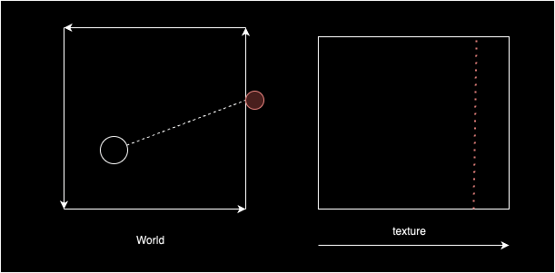
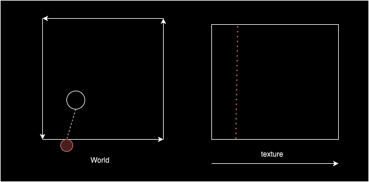
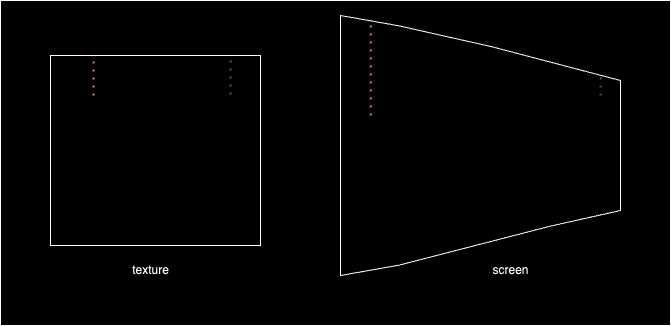

# Stage 7: Textures
Now let's add textures. Curiously, this task decomposes neatly into three stages.

## Loading and Drawing Textures
In the code there are now some textures, let's define their filenames.

<systems/renderer.py>:
```
#---- Constants ----#
#region
TEXTURE_FILENAMES = (
    "img/comp1_1.jpg",
    "img/tech01_2.jpg",
    "img/tech01_7.jpg",
    "img/tech08_1.jpg",
    "img/tech09_3.jpg",
    "img/twall2_6.jpg",)
#endregion
```

Since the code is getting a bit large, the region and endregion tags can be used in vscode to make collapsable regions.

Now let's make a helper function to load a texture.
```
#---- Helper Functions ----#
#region
def load_texture(filename: str) -> np.ndarray:

    surface = pg.image.load(filename).convert()
    array = pg.surfarray.array2d(surface)
    return array

# ...
```

Then a bit of refactoring, load the textures in the renderer.
```
class Renderer:

    def __init__(self, width: int, height: int, 
                 game_map: np.ndarray, player: np.ndarray):

        # ...
        
        textures = [load_texture(filename) for filename in TEXTURE_FILENAMES]

        # ...
```

Pass the textures to the game renderer, which passes them along to the raytrace function.

```
class GameRenderer:

    def __init__(self, width: int, height: int, 
                 game_map: np.ndarray, 
                 colors: tuple[int], 
                 textures: tuple[np.ndarray],
                 screen_pixels: np.ndarray,
                 player: np.ndarray):

        self.width = width
        self.height = height
        self.screen_pixels = screen_pixels
        self.textures = textures
        self.colors = colors
        self.player = player
        self.map = game_map
    
    def update(self):
        """
            Draws a frame
        """

        raycast_scene(self.player, self.width, self.height, self.map, 
                      self.screen_pixels, self.colors, self.textures)
```

Now we'll make a function to draw a textured vertical line. The purpose of this function will not be accurate rendering, it will just be here to test that the textures were loaded correctly. We're using the x and y coordinates of the screen as texture coordinates also.
```
@njit()
def draw_vertical_line_textured(color_buffer: np.ndarray, 
                texture: np.ndarray, x: int, y1: int, y2: int) -> None:
    tex_width, tex_height = texture.shape
    tex_x = min(tex_width - 1, max(0, x))

    y = y1
    while y < y2:
        tex_y = min(tex_height - 1, max(0, y))
        color_buffer[x][y] = texture[tex_x][tex_y]
        y += 1
```

Finally we can call this function instead of the vertical line function. The floor and ceiling vertical lines weill be unchanged.
```
@njit()
def raycast_scene(camera: np.ndarray, width: int, height: int, 
    game_map: np.ndarray, color_buffer: np.ndarray, 
    colors: tuple[int], textures: tuple[np.ndarray]):
    
    forwards = rotate(1, 0, camera[2])
    right = rotate(0, -1, camera[2])
    for x in range(width):

        # ...
        texture = textures[tile - 1]

        # ceiling
        draw_vertical_line(color_buffer, colors[2], x, 0, y_top)
        # wall
        draw_vertical_line_textured(color_buffer, texture, x, y_top, y_bottom)
        # floor
        draw_vertical_line(color_buffer, colors[3], x, y_bottom, height)
```

If this worked correctly then we should be seeing some pretty funky effects!

## Texture X-Coordinate
Consider a top-down view of the world:


We can visualise a wall segment as either running along the x or y axis, the x texture coordinate tracks how far a ray's intersection point is from the wall segment's origin. 

If the ray took a horizontal step to hit a wall segment, then it hit a vertical wall segment, and the texture x coordinate is given by the y coordinate of the hit.



Similarly, if the ray took a vertical step to hit a wall, then it hit a horizontal wall segment, and the texture x coordinate is given by the x coordinate of the hit.



Adjust the trace function so that it also returns the side variable, then use that information to get the texture x coordinate.

```
@njit()
def raycast_scene(camera: np.ndarray, width: int, height: int, game_map: np.ndarray, 
    color_buffer: np.ndarray, colors: tuple[int], textures: tuple[np.ndarray]):
    
    forwards = rotate(1, 0, camera[2])
    right = rotate(0, -1, camera[2])
    for x in range(width):

        ray = get_ray(x, width, forwards, right)

        distance, tile, side = trace(ray, camera, game_map)

        wall_height = 0.5 * height / distance

        y_top = int(max(0, int(0.5 * height - wall_height)))
        y_bottom = int(min(height - 1, int(0.5 * height + wall_height)))
        texture = textures[tile - 1]

        # exact position along wall where hit occurred
        u = camera[1] + ray[1] * distance if side == 0 else camera[0] + ray[0] * distance
        # in fraction form
        u = u - int(u)

        tex_width = texture.shape[0]
        tex_x = int(u * tex_width)

        # ceiling
        draw_vertical_line(color_buffer, colors[2], x, 0, y_top)
        # wall
        draw_vertical_line_textured(color_buffer, texture, tex_x, x, y_top, y_bottom)
        # floor
        draw_vertical_line(color_buffer, colors[3], x, y_bottom, height)
```

Then adjust the textured line function appropriately.
```
@njit()
def draw_vertical_line_textured(color_buffer: np.ndarray, 
                texture: np.ndarray, tex_x: int, x: int, y1: int, y2: int) -> None:
    tex_height = texture.shape[1]

    y = y1
    while y < y2:
        tex_y = min(tex_height - 1, max(0, y))
        color_buffer[x][y] = texture[tex_x][tex_y]
        y += 1
```

The walls should now be anchored in the x axis, but a subtle effect is going on, walls seem to mirror each other weirdly. The texture coordinates can be reversed depending on which wall was hit.

```
tex_x = int(u * tex_width)
if side == 0 and ray[0] > 0:
    tex_x = tex_width - 1 - tex_x
if side == 1 and ray[1] < 0:
    tex_x = tex_width - 1 - tex_x
```

## Texture Y-Coordinate

Currently we're stepping down one pixel at a time along a vertical line, choosing a pixel from the texture and drawing it on the screen. But there's a problem, in reality a texture could be squashed or stretched.



A wall segment actually has two heights, the original intended height and the height on screen. We need to work out how far to step down the texture for every pixel we step down on the screen.

```
@njit()
def draw_vertical_line_textured(color_buffer: np.ndarray, 
                texture: np.ndarray, tex_x: int,
                x: int, y1: int, y2: int, wall_height: int) -> None:
    tex_height = texture.shape[1]
    dv = tex_height / (2.0 * wall_height)
    v = 0
    y = y1

    while y < y2:
        tex_y = min(tex_height - 1, int(v))
        color_buffer[x][y] = texture[tex_x][tex_y]
        v = v + dv
        y += 1
```

This is an improvement, but it isn't handling the case where the top of the wall is actually clipped. For this we need to calculate the top of the unclipped wall, then use that to find how many pixels were clipped and account for it.

```
@njit()
def draw_vertical_line_textured(color_buffer: np.ndarray, 
                texture: np.ndarray, tex_x: int,
                x: int, y1: int, y2: int, wall_height: int) -> None:
    
    tex_height = texture.shape[1]
    screen_height = color_buffer.shape[1]

    true_wall_top = int(0.5 * screen_height - wall_height)
    clipping = max(0, -true_wall_top)

    dv = tex_height / (2.0 * wall_height)
    v = clipping * dv
    y = y1

    while y < y2:
        tex_y = min(tex_height - 1, int(v))
        color_buffer[x][y] = texture[tex_x][tex_y]
        v = v + dv
        y += 1
```

And there we have it!