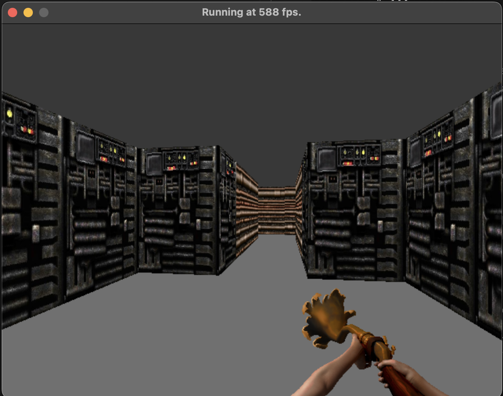

# Stage 8: Gun
Let's improve our world by adding guns.

## Loading and Drawing a Gun
The first step is to select an image for our gun. This is easy to overlook but it does matter. For our tutorial I chose to use [Alice Toys of Madness](https://github.com/jekyllgrim/Alice-Toys-of-Madness/tree/main), but anything should be fine.

Once we've selected an image, we'll need to define the filenames.

<systems/renderer.py>:
```
#---- Constants ----#
#region
# ...

GUN_FILENAMES = (
    "img/BBUSA.png",
    "img/BBUSB.png",
    "img/BBUSC.png",
    "img/BBUSD.png",
    "img/BBUSE.png",
    "img/BBUSF.png",
    "img/BBUSG.png",
    "img/BBUSH.png",
    "img/BBUSI.png",
)
#endregion
```

With textures I converted to an array because I wanted to draw them to the color buffer directly. However our gun will not appear in the 3D world, rather it'll be an overlay. Let's go ahead and write a new function to load an image.

```
def load_image(filename: str) -> pg.Surface:

    return pg.image.load(filename).convert_alpha()
```

Convert alpha will convert the loaded image into the screen's native format, including alpha transparency. We can now go ahead and load the gun frames.

```
class GameRenderer:

    def __init__(self, # ...):

        # ...
        self.gun_frames = [load_image(filename) for filename in GUN_FILENAMES]
```

It's time to revisit the way this is working. Currently the renderer system holds the screen surface. It gives a numpy array of pixels to the renderer states to fill, but retains control of that original surface. However, with the gun it would be nice to do regular pygame surface blitting. Let's refactor so that the states now take in the surface and handle color buffer blitting.

```
class Renderer:
    """
        Responsible for drawing scenes
    """

    def __init__(self, width: int, height: int, 
                 game_map: np.ndarray, player: np.ndarray):

        # ...

        self.states = (
            GameRenderer(width, height, game_map, colors, textures, 
                         self.screen_pixels, player, self.screen_surface),
            MapRenderer(width, height, game_map, colors, 
                        self.screen_pixels, player, self.screen_surface)
        )
        # ...
    
    # ...
    
    def update(self):
        """
            Draws a frame
        """

        self.state.update()
        pg.display.flip()

class GameRenderer:

    def __init__(self, width: int, height: int, 
                 # ...
                 screen: pg.Surface):

        # ...
        self.screen = screen
    
    def update(self):
        """
            Draws a frame
        """

        raycast_scene(self.player, self.width, self.height, self.map, 
                      self.screen_pixels, self.colors, self.textures)
        pg.surfarray.blit_array(self.screen, self.screen_pixels)

class MapRenderer:

    def __init__(self, width: int, height: int, 
                 # ...
                 screen: pg.surface):

        # ...
        self.screen = screen
        
    def update(self):
        """
            Draws a frame
        """

        # ...

        pg.surfarray.blit_array(self.screen, self.screen_pixels)
```

We're now ready to draw a gun!
```
def update(self):
    """
        Draws a frame
    """

    raycast_scene(self.player, self.width, self.height, self.map, 
                    self.screen_pixels, self.colors, self.textures)
    pg.surfarray.blit_array(self.screen, self.screen_pixels)
    self.draw_gun()

def draw_gun(self) -> None:

    dest = (320, 160)
    self.screen.blit(self.gun_frames[0], dest)
```



## Walk Sway

If we wanted, we could leave the session at this, but let's improve it. I'd like the gun to sway side to side as we walk. This could be accomplished by adding a few if statements to our renderer, but I want to be a little more sophisticated with it. I want a way to segregate the controller logic from the renderer a little. How can we do this? In a word: observers.

Imagine that we have a data structure representing a message. For now it'll just be a simple code.

<config.py>:
```
MESSAGE_TYPE_PLAYER_WALKING = 0
MESSAGE_TYPE_PLAYER_STOP = 1
```

A system can then "observe" messages by tracking them with an event queue.

<systems/renderer.py>:
```
def update(self):

    for event in self.event_queue:
        if event == MESSAGE_TYPE_PLAYER_WALKING:
            # do something
            pass
        elif event == MESSAGE_TYPE_PLAYER_STOP:
            # do something else
            pass
    
    self.event_queue.clear()

    # ...
```

So systems can act as observers, but how do we feed them messages? Simple! A system can be observed by tracking a list of all the event queues it will publish to.

<controller/game.py>:
```
def __init__(self):

    # ...

    # make systems
    self.renderer = Renderer(self.screen_width, self.screen_height, 
                                self.map, self.player)
    
    self.observers: list[list[int]] = []
    self.observers.append(self.renderer.event_queue)

def publish(self, message: int) -> None:

    for observer in self.observers:
        observer.append(message)
```

Of course things get a little trickier with our renderer being a state machine, but not by much. We can assume that the renderer has one and only one state, and that an update will handle all pending events in that frame. In other words, the renderer own an event queue, and pass it to its states to manage as they wish.

<systems/renderer.py>:
```
class Renderer:

    def __init__(self, width: int, height: int, 
                 game_map: np.ndarray, player: np.ndarray):
        
        # ...

        self.event_queue = []

        self.states = (
            GameRenderer(width, height, game_map, colors, textures, 
                        self.screen_pixels, player, self.screen_surface,
                        self.event_queue),
            MapRenderer(width, height, game_map, colors, 
                        self.screen_pixels, player, self.screen_surface,
                        self.event_queue)
        )
        # ...
    
    # ...
    
    def update(self):

        self.state.update()
        self.event_queue.clear()
        pg.display.flip()

class GameRenderer:

    def __init__(self, width: int, height: int, 
                 # ...
                 event_queue: list[int]):

        # ...

        self.event_queue = event_queue
    
    def update(self):

        for event in self.event_queue:
            if event == MESSAGE_TYPE_PLAYER_WALKING:
                # do something
                pass
            elif event == MESSAGE_TYPE_PLAYER_STOP:
                # do something else
                pass

        # ...
    
    # ...

class MapRenderer:

    def __init__(self, width: int, height: int, 
                 # ...
                 event_queue: list[int]):

        # ...

        self.event_queue = event_queue
        
    # ...
```

Note something interesting: the renderer is in charge of clearing its event queue rather than the states! This is good for reducing duplicated code, but has another massive benefit: the map view can completely ignore the event queue. The overarching philosophy with this sort of system design is to build belts rather than rods. With a rod, components are tightly coupled and interdependent, whereas mechanical components connected by belts communicate with each other, but are more independent. Our renderer is not dependent on its state cleaning up the event queue.

With that out of the way, let's publish walk/stop events.

<controllers/game.py>:
```
def handle_keys(self) -> None:

    # ...

    if magnitude == 0:
        self.publish(MESSAGE_TYPE_PLAYER_STOP)
        return
    self.publish(MESSAGE_TYPE_PLAYER_WALKING)

    # ...
```

And handle them in the GameRenderer:

<systems/renderer.py>:
```
class GameRenderer:

    def __init__(self, #...):

        # ...

        self.player_walking = False
        self.player_walking_offset = 0.0
        self.player_walk_t = 0
    
    def update(self, frametime: float):
        """
            Draws a frame
        """

        for event in self.event_queue:
            if event == MESSAGE_TYPE_PLAYER_WALKING:
                self.player_walking = True
                self.player_walking_t = 0
            elif event == MESSAGE_TYPE_PLAYER_STOP:
                self.player_walking = False

        # ...
    
    def draw_gun(self, frametime: float) -> None:

        if self.player_walking:
            self.player_walking_t += frametime
            self.player_walking_offset = 20.0 * np.sin(0.01 * self.player_walking_t)
        else:
            sign = np.sign(self.player_walking_offset)
            self.player_walking_offset -= sign * 0.1 * frametime
            if (np.sign(self.player_walking_offset) * sign) < 0.0:
                self.player_walking_offset = 0.0

        dest = (320 + self.player_walking_offset, 160)
        self.screen.blit(self.gun_frames[0], dest)
```

## Shooting
We can walk around, let's shoot! Luckily, the framework we built for walking also lets us handle shooting events.

Define a shooting message code.

<config.py>:
```
MESSAGE_TYPE_PLAYER_SHOOT = 2
```

Publish it from the game controller.

<controllers/game.py>:
```
def play(self):

    running = True
    self.frametime = 0.0
    while (running):
        #events
        for event in pg.event.get():

            if (event.type == pg.MOUSEBUTTONDOWN):
                self.publish(MESSAGE_TYPE_PLAYER_SHOOT)

            # ...
```

And handle it in the GameRenderer.

<systems/renderer.py>:
```
class GameRenderer:

    def __init__(self, # ...):

        # ...

        self.player_shooting = False
        self.gun_frame_index = 0
        self.gun_frame_time = 0
    
    def update(self, frametime: float):

        for event in self.event_queue:
            # ...
            elif event == MESSAGE_TYPE_PLAYER_SHOOT:
                self.player_shooting = True
                self.gun_frame_index = 1


        raycast_scene(self.player, self.width, self.height, self.map, 
                      self.screen_pixels, self.colors, self.textures)
        pg.surfarray.blit_array(self.screen, self.screen_pixels)
        self.draw_gun(frametime)
    
    def draw_gun(self, frametime: float) -> None:

        # ...

        ms_per_frame = 75
        
        if self.player_shooting:
            self.gun_frame_time += frametime

            if self.gun_frame_time > ms_per_frame:
                self.gun_frame_time -= ms_per_frame
                self.gun_frame_index += 1

            if (self.gun_frame_index >= len(self.gun_frames)):
                self.gun_frame_index = 0
                self.player_shooting = False

        dest = (320 + self.player_walking_offset, 160)
        self.screen.blit(self.gun_frames[self.gun_frame_index], dest)
```

Now there's an issue: the player can continually shoot! The reload animation means nothing!
Well we can be a little tricky here: let's make the renderer publish to the game when its animation is done.

Firstly move the publish function to a public helper.

<config.py>:
```
MESSAGE_TYPE_PLAYER_RELOAD = 3

def publish(message: int, observers: list[list[int]]) -> None:

    for observer in observers:
        observer.append(message)
```

Now give the game an event queue.

<controller/game.py>:
```
class Game:

    def __init__(self):

        # ...

        self.event_queue: list[int] = []

        # ...

        self.can_shoot = True
    
    # ...

    def play(self):

        running = True
        self.frametime = 0.0
        while (running):
            #events

            for event in self.event_queue:
                if (event == MESSAGE_TYPE_PLAYER_RELOAD):
                    self.can_shoot = True
            
            self.event_queue.clear()
            
            for event in pg.event.get():

                if (event.type == pg.MOUSEBUTTONDOWN and self.can_shoot):
                    self.can_shoot = False
                    publish(MESSAGE_TYPE_PLAYER_SHOOT, self.observers)

                # ...
```

Finally we can link everything up.

<systems/renderer.py>:
```
class Renderer:

    def __init__(self, width: int, height: int, 
                 game_map: np.ndarray, player: np.ndarray):

        # ...

        self.event_queue = []
        self.observers: list[list[int]] = []

        self.states = (
            GameRenderer(width, height, game_map, colors, textures, 
                         self.screen_pixels, player, self.screen_surface,
                         self.event_queue, self.observers),
            MapRenderer(width, height, game_map, colors, 
                        self.screen_pixels, player, self.screen_surface,
                        self.event_queue, self.observers)
        )
        # ...
    
    # ...

class GameRenderer:

    def __init__(self, width: int, height: int, 
                 # ...
                 observers: list[list[int]]):

        # ...

        self.observers = observers
    
    # ...
    
    def draw_gun(self, frametime: float) -> None:

        # ...
        
        if self.player_shooting:
            # ...

            if (self.gun_frame_index >= len(self.gun_frames)):
                self.gun_frame_index = 0
                self.player_shooting = False
                publish(MESSAGE_TYPE_PLAYER_RELOAD, self.observers)

        # ...

class MapRenderer:

    def __init__(self, width: int, height: int, 
                 # ...
                 observers: list[list[int]]):

        # ...

        self.observers = observers
    # ...
```

<controller/game.py>:
```
class Game:

    def __init__(self):

        # ...

        self.event_queue: list[int] = []
        self.observers: list[list[int]] = []

        # make systems
        self.renderer = Renderer(self.screen_width, self.screen_height, 
                                 self.map, self.player)
        self.renderer.observers.append(self.event_queue)
        
        self.observers.append(self.renderer.event_queue)

        # ...
    
    # ...
```

It's very difficult to understate the power of this technique. The dream in game development is for any system to message any other part of the system. Doing this in a performant and sane way without circular imports is tricky, but now it's possible!