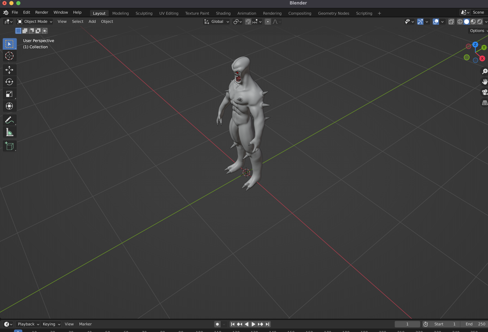
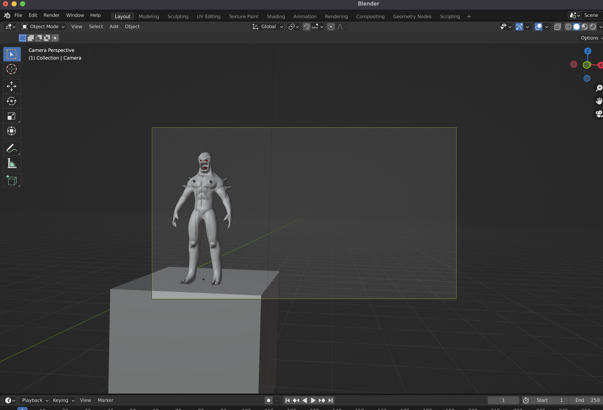
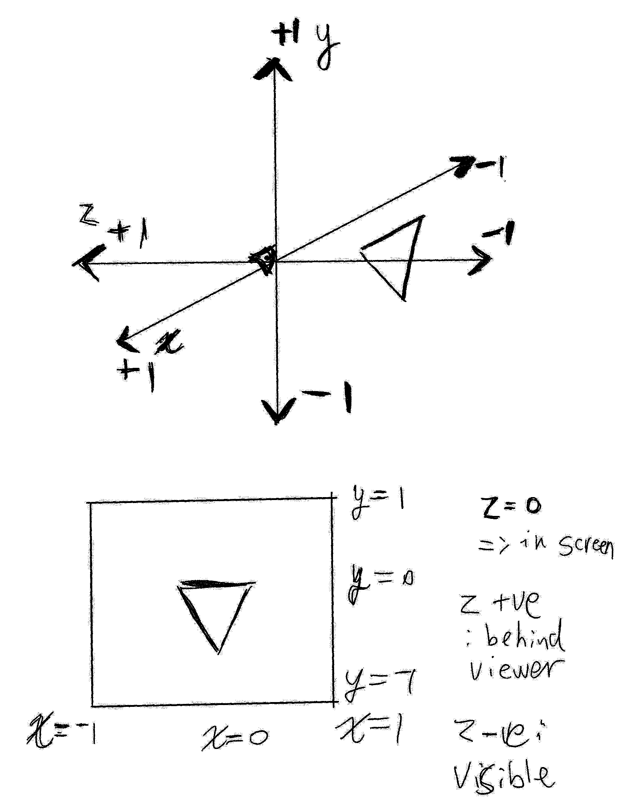
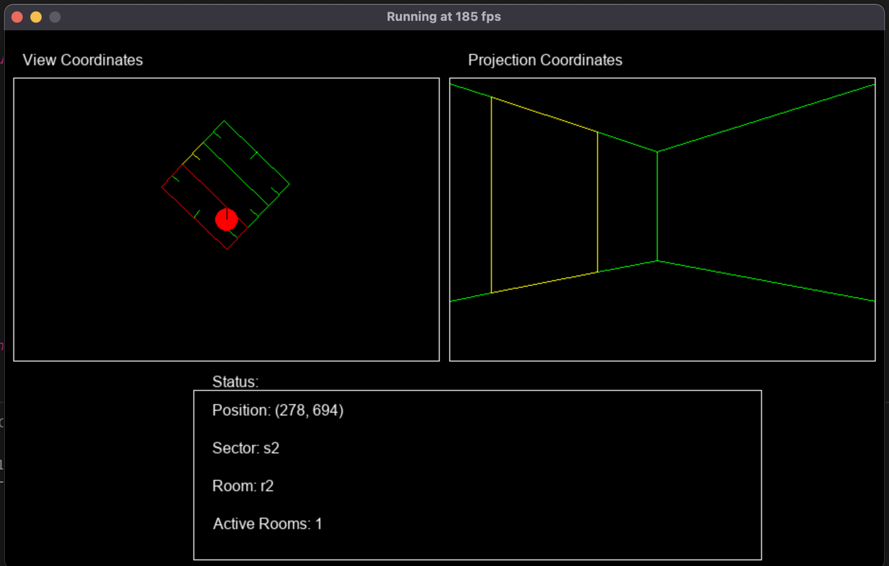

# COSC3000 Practical 2:
## Cameras and Projections
Hopefully the week 1 prac went ok. Don't worry if you didn't get it all done, finished code is provided and the most important thing is that you understood the concepts. \
In this practical we'll drill down further into transformations, looking at coordinate spaces and how to change between them. \
Bonus content will cover implementing first and third person cameras.
## Coordinate Spaces
Roughly speaking there are four coordinate spaces of interest:
- Model Space
- World Space
- View Space
- Screen Space
  
To better illustrate this: Imagine you've been hired by Ego Software to develop their latest title, Gloom Internal. You fire up Blender and make a formidable enemy: the Imperial Soldier.\
</img>
The Imp is currently in model space, its origin is at its feet. If we scale, move or spin it, it moves around its origin. Now let's say we want to put it somewhere in a scene.
</img>
So there it is, in world space, out in the world. The matrix which was applied is commonly called a model transform, since it takes models and puts them into world space (yes, the name could be better.)\
Great! But now see we have a camera. How do we see the camera's perspective? The answer is a bit of hackery. If I turn my head left, does my head move left, or does the world move right? A view transform applies whatever translations and rotations are needed to set the camera at the origin of the world (actually it's the inverse of the camera's model transform.)\
After applying a view transform, we get the world space into view space.
</img>
Perspective Projection then occurs, this is a little more esoteric but the basic idea is prepare coordinates so that after perspective division occurs they'll be in Normalized Device Coordinates.
For more details on view and projection transforms, the following [video](https://www.youtube.com/watch?v=nCWApy9gCQQ) may help.
### 1: Getting some Perspective
Navigate to the "projected triangle" folder, then in the apps initialization, look at the line

In App's make_assets function:
```python
self.triangle = Component(
    position = [0,0,0],
    eulers = [0,0,0]
)
```
Try changing the z value of position, what effect does it have? For which range of values does the triangle appear on the screen? By default, OpenGL works in Normalized Device Coordinates (NDC),



The convention of negative z defining the visible space can be confusing, it's based around the right hand rule if that makes things easier to remember. Other graphics APIs get around this by using the left hand rule, or reversing the direction of y. Anyway, z values in the range [-1,1] seem to work, but the size of the triangle doesn't change based on how far away it is. Adding a perspective transformation can fix this. Head to the vertex shader and declare it as a uniform:

In vertex.txt:
```
#version 330 core

layout (location=0) in vec3 vertexPos;
layout (location=1) in vec3 vertexColor;

uniform mat4 model;
uniform mat4 projection;

out vec3 fragmentColor;

void main()
{
    gl_Position = projection * model * vec4(vertexPos, 1.0);
    fragmentColor = vertexColor;
}
```

So as we can see, we first hit the triangle with the model transform, which sends it from model (local) space to world space, then we hit it with a projection transform, which will send it from world space to clip space (so called because anything outside of this region is clipped). Pyrr has a handy function for making such a perpective projection matrix:
```python
pyrr.matrix44.create_perspective_projection(fovy, aspect, near, far, dtype)
```
- fovy: angle of vertical view. Setting this wider can give a more "fisheye" looking view. setting it smaller makes everything tighter, more zoomed in
- aspect: width/height
- near: everything closer than this distance will be ignored
- far: everything further than this distance will be ignored
- dtype: as with all matrices, set this to 32 bit floating point in order to work properly

We can create a perspective transform and send it in. For our example we're setting and forgetting, so we can call this once in the app initialization.\
In App's set_onetime_uniforms function:
```python
projection_transform = pyrr.matrix44.create_perspective_projection(
    fovy = 45, aspect = 640 / 480, near = 0.1, far = 10, dtype = np.float32
)
glUniformMatrix4fv(glGetUniformLocation(self.shader, "projection"), 1, GL_FALSE, projection_transform)
```

Now try playing with the triangle's z coordinate again. What ranges are acceptable? What effect does it have?

Note: It's tempting to set near = 0.001, far = 9999, or somesuch, but that's a bad idea. As discussed in lectures, the perspective transformation matrix is approximating the a quadratic transform with a linear transformation, and the accuracy of this approximation gets worse as the the difference between near and far increases. For most cases it's unnoticeable, but in an extreme case, it will produce weird visual effects. Especially in the next prac, where we look at depth testing.

### View transform
This is good and all, but there are some issues. What if we want a moving, rotating camera? Or we want to specify z as the vertical axis, with x and y making up the horizontal plane? We need to take the world and transform it from world coordinates to the standardized form we've been using in previous examples. This is called a view transform, it converts world coordinates to so called view coordinates. To illustrate the basic idea, load up the view prototype. Play around with it and convince yourself, the camera stays still and the world moves around it. There are two basic steps:
- subtract the camera's position from all coordinates, this sets the camera as the center of the world.
- rotate all points opposite to the camera's angle.\
  \
</img>

Open up the "first person" folder. The same principle of this prototype applies in general, we add a third matrix to our vertex shader.

vertex.txt:
```
#version 330 core

layout (location=0) in vec3 vertexPos;
layout (location=1) in vec3 vertexColor;

uniform mat4 model;
uniform mat4 view;
uniform mat4 projection;

out vec3 fragmentColor;

void main()
{
    gl_Position = projection * view * model * vec4(vertexPos, 1.0);
    fragmentColor = vertexColor;
}
```

Now let's make a camera object.
```python
class Camera:


    def __init__(self, position, eulers):

        self.position = position
        self.eulers = eulers

        #local directions (before rotation)
        self.localUp = np.array([0,0,1], dtype=np.float32)
        self.localRight = np.array([0,1,0], dtype=np.float32)
        self.localForwards = np.array([1,0,0], dtype=np.float32)

        #directions after rotation
        self.up = np.array([0,0,1], dtype=np.float32)
        self.right = np.array([0,1,0], dtype=np.float32)
        self.forwards = np.array([1,0,0], dtype=np.float32)

        self.viewTransform = pyrr.matrix44.create_identity(dtype=np.float32)
    
    def update(self):

        cameraRotation = pyrr.matrix33.create_from_y_rotation(
            theta= np.radians(self.eulers[1]), 
            dtype=np.float32
        )
        cameraRotation = pyrr.matrix33.multiply(
            m1 = cameraRotation,
            m2 = pyrr.matrix33.create_from_z_rotation(
                theta = np.radians(self.eulers[2]),
                dtype = np.float32
            )
        )

        self.up = pyrr.matrix33.multiply(
            m1 = self.localUp,
            m2 = cameraRotation
        )
        self.right = pyrr.matrix33.multiply(
            m1 = self.localRight,
            m2 = cameraRotation
        )
        self.forwards = pyrr.matrix33.multiply(
            m1 = self.localForwards,
            m2 = cameraRotation
        )

    def get_view_transform(self) -> np.ndarray:
        
        return pyrr.matrix44.create_look_at(
            eye = self.position,
            target = self.position + self.forwards,
            up = self.up,
            dtype = np.float32
        )
```
We're holding three fundamental directions in the camera object, its forwards, up and right vectors. The lookat function only needs the forwards and up vectors, but we might want the right vector too in some cases (eg. the later exercise with a third person camera).

Now we fetch the location of the view uniform. \
In App's get_uniform_locations:
```python
        self.viewMatrixLocation = glGetUniformLocation(self.shader, "view")
```
And use that location to send the matrix to the uniform.\
In App's mainLoop:
```
    glUniformMatrix4fv(
        self.viewMatrixLocation,
        1,GL_FALSE,
        self.scene.camera.get_view_transform()
    )
```

### Third Person Camera
We know how to make a first person camera! That's cool, how can we extend it? Well obviously if we represent the camera and player as different objects, then put some distance between them, we'll have a basic third person camera. But there are some extra features we can add.

Let's say we want the camera to focus on the player, spin around the camera when we press a or d, then pivot above or below the player when we press w or s, this is where the camera's up and right vectors will be really useful. Navigate to "Third Person Camera" and add/modify the following classes:

```python
class Camera(Entity):
    """ A third person camera controller. """

    def __init__(self, position):

        super().__init__(position, eulers = [0,0,0])

        self.forwards = np.array([0, 0, 0],dtype=np.float32)
        self.right = np.array([0, 0, 0],dtype=np.float32)
        self.up = np.array([0, 0, 0],dtype=np.float32)

        self.localUp = np.array([0, 0, 1], dtype=np.float32)
        self.targetObject: Entity = None

    def update(self) -> None:
        """ Updates the camera """

        self.calculate_vectors_cross_product()
    
    def calculate_vectors_cross_product(self) -> None:
        """ 
            Calculate the camera's fundamental vectors.

            There are various ways to do this, this function
            achieves it by using cross products to produce
            an orthonormal basis.
        """
        
        self.forwards = pyrr.vector.normalize(self.targetObject.position - self.position)
        self.right = pyrr.vector.normalize(pyrr.vector3.cross(self.forwards, self.localUp))
        self.up = pyrr.vector.normalize(pyrr.vector3.cross(self.right, self.forwards))

    def get_view_transform(self) -> np.ndarray:
        """ Return's the camera's view transform. """

        return pyrr.matrix44.create_look_at(
            eye = self.position, 
            target = self.targetObject.position, 
            up = self.up,
            dtype = np.float32
        )

class Player(Triangle):
    """ A player character """


    def __init__(self, position, eulers, scale):
        """ Initialise a player character. """
        
        super().__init__(position, eulers, scale)
        self.camera = None
    
    def update(self, target: Triangle) -> None:
        """
            Update the player.

            Parameters:

                target: the triangle to move towards.
        """

        if target is not None:
            self.move_towards(target.position, 0.1)

    def move_towards(self, targetPosition: np.ndarray, amount: float) -> None:
        """
            Move towards the given point by the given amount.
        """
        directionVector = targetPosition - self.position
        angle = np.arctan2(-directionVector[1],directionVector[0])
        self.move(angle, amount)
    
    def move(self, direction: float, amount: float) -> None:
        """
            Move by the given amount in the given direction (in radians).
        """
        self.position[0] += amount * np.cos(direction, dtype=np.float32)
        self.position[1] -= amount * np.sin(direction, dtype=np.float32)
        self.camera.position[0] += amount * np.cos(direction, dtype=np.float32)
        self.camera.position[1] -= amount * np.sin(direction, dtype=np.float32)
        self.eulers[2] = np.degrees(direction) - 45
```
The player is very similar to an Entity except it has the ability to move towards points, note that the y coordinates are flipped around, this is in order to account for pygame's flipped y coordinate axis. The player also has a reference to the camera object so that when it moves, it pulls the camera along with it.

The camera object is now using the vector cross product to calculate its right and up vectors. The reason for this is that we want it to look at arbitrary points, so keeping track of its direction and then rotating things is less convenient. It has a reference to the player object so that it always knows which point to look at.

These objects can then be created in the Scene class:

In Scene's initialiser:
```python
self.player = Player(
    position = [0,1,0],
    eulers = [0,0,0],
    scale = [1,1,1]
)
self.camera = Camera(position = [-3,1,3])
self.player.camera = self.camera
self.camera.targetObject = self.player
```

Getting back to that camera strafing, we'll need a function to move the camera.\
In the Scene class:
```python
def move_camera(self, dPos):

    self.camera.position += dPos[0] * self.camera.forward \
        + dPos[1] * self.camera.right \
        + dPos[2] * self.camera.up
```
The camera's position shifts according to its fundamental vectors, say the camera takes a step to its right, but it's still looking at the player, who hasn't moved, this produces circular motion.

Now we just need to define the wasd keys and mouse clicks. We have the scene set up so that if it takes a vector it'll move strafe the camera. Let's use that.\

In App:
```python
def handleKeys(self):

    keys = pg.key.get_pressed()
    rate = self.frameTime / 16
    camera_movement = [0,0,0]

    if keys[pg.K_w]:
        #up
        camera_movement[2] += 1
    if keys[pg.K_a]:
        #left
        camera_movement[1] -= 1
    if keys[pg.K_s]:
        #down
        camera_movement[2] -= 1
    if keys[pg.K_d]:
        #right
        camera_movement[1] += 1
            
    dPos = 0.1 * rate * np.array(
        camera_movement,
        dtype = np.float32
    )

    self.scene.move_camera(dPos)
```
For the mouse click we want to turn screen coordinates into world coordinates. This seems intimidating at first, until we realize that's literally the purpose of the camera's forwards, right and up vectors.

The concept is simple enough, we take the mouse's displacement from the center, divide by some normalizing factor (in this case, the width of the screen), then that indicates the coefficients a and b to use in the vector addition on the diagram. This resultant vector is the direction passing from the camera's eye, though the point that the user clicked on, we can then loop (or solve a simple linear equation) to calculate the point on the ground. Here's the full function:
```python
def handleMouse(self):

        #fetch camera's vectors
        forward = self.scene.camera.forwards
        up = self.scene.camera.up
        right = self.scene.camera.right

        #get mouse's displacement from screen center
        (x,y) = pg.mouse.get_pos()
        rightAmount = (x - self.screenWidth//2)/self.screenWidth
        upAmount = (self.screenHeight//2 - y)/self.screenWidth

        #get resultant direction (from camera eye, through point on screen)
        resultant = pyrr.vector.normalize(forward + rightAmount * right + upAmount * up)

        #trace from camera's position until we hit the ground
        if (resultant[2] < 0):
            x = self.scene.camera.position[0]
            y = self.scene.camera.position[1]
            z = self.scene.camera.position[2]
            while (z > 0):
                x += resultant[0]
                y += resultant[1]
                z += resultant[2]
            self.scene.lay_down_dot(
                position = [x,y,0]
            )
```
And that's it! If we run the program now we should be able to use wasd to spin the camera around the player, and clicking should lay down points for the player to move to. As always, double check your program against the finished copy if things aren't quite working.

#### Bonus: Creative use of Transformations

Load up the "Kurtosis" folder, and try the program out. What's happening here? Even without using textures or fancy graphics programming, it's possible to make some pretty cool things by playing with transformations.
