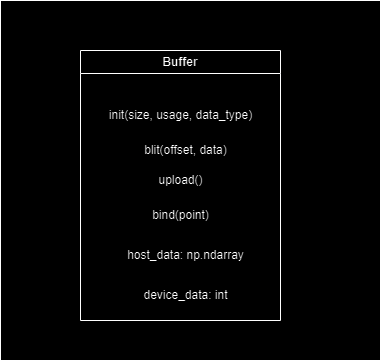
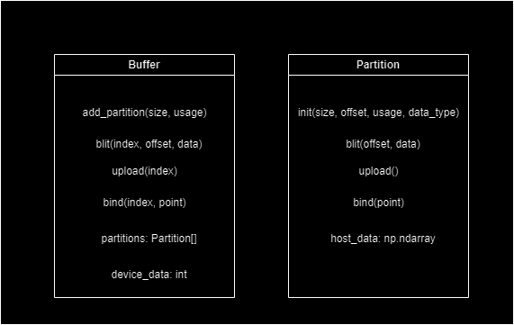

# Let's Build a Buffer!
In this tutorial we'll build an abstract buffer object which we can use in later projects to greatly simplify our process.

## The Rules of the Game
Usually when building a buffer, we simply generate a buffer, declare or upload data, and then bind the buffer whenever needed. 

With this use case in mind consider the following interface, we want to be able to declare the buffer size in bytes, as well as maybe keep some store on the CPU for sparse updates. We'll also want to know the buffer's intended usage, and have some function for binding and uploading.



This is fine for most cases but is leaving a lot of decisions up to the GPU. Consider the case of redering a frame, our shader may use some bundle of resources, for instance four storage buffers. These may be bound once upon beginning rendering and resident at the same bind points for the lifetime of the render. In this case, since everything is just a buffer, wouldn't it be great if we could just declare some big storage block which holds all four buffers? Turns out we can!

We'll split the concept of a buffer into two sub-concepts: a buffer is a memory allocation on the GPU, nothing less and nothing more. It's just ones and zeros. In order to be used, a region of the buffer must be bound. Now our buffer class will manage a collection of partitions. Each partition has its own size, offset, usage and backing memory. In order to use our buffer class we first instantiate the class, then describe the partitions we want, then finally do the work of actually allocating memory on the GPU.



There's only one theoretical issue to tackle before we get to coding anything up: allignment. Graphics cards require that bindpoints be multiples of certain numbers. For instance, nvidia cards typically have a minimum storage buffer alignment of 256 bytes, so for some configurations everything will work fine and for others it will fail, this can be very frustrating. Just something to keep in mind.

The process for alligning an offset is simple: we just need to know how far we are off from the next multiple of alignment.
```
padding = alignment - offset % alignment
```

In the case where we are spot on, it would be preferable to wrap the padding around to zero again.
```
padding = (alignment - offset % alignment) % alignment
```

In these instances, alignment will always be a power of two, so the modulus operation can be replaced with a bitwise and.
```
padding = (alignment - offset & (alignment - 1)) & (alignment - 1)
```

With that out of the way, let's get started!

## Storage Buffers
As a storage buffer example I'm using some code from my raytracing example. Let's start by defining a class for a partition.

< bufer.py: >
```
class Partition:
    """
        Describes a bindable region of a buffer.
    """

    def __init__(self, size: int, offset: int, dtype: np.dtype, target: int, binding_index: int):
        """
            Create a new partition.

            Arguments:

                size: number of bytes allocated for the region

                offset: offset of the region within its buffer, in bytes

                dtype: data type of elements in the region

                target: binding target of the region

                binding_index: bind point
        """

        self.size = size
        self.offset = offset
        instantiated = np.dtype(dtype)
        element_count = int(size / instantiated.itemsize)
        self.host_memory = np.zeros(element_count, dtype)
        self.target = target
        self.binding_index = binding_index
    
    def blit(self, data: np.ndarray):
        """
            Copy all elements from the given array into the backing memory.
        """

        self.host_memory[:] = data[:len(self.host_memory)]
```

Now let's start working on the buffer itself. The initializer sets up some variables used for housekeeping. Usage flags and buffer size will adjust as partitions are added.

```
class Buffer:

    def __init__(self):

        self.size = 0
        self.partitions: list[Partition] = []
        self.usage = 0
        self.device_memory = 0
```

Now let's add a function for declaring a partition.

```
def add_partition(self, size: int, dtype: np.dtype, usage: int, binding_index: int) -> int:
        
        offset = self.size
        padding = (256 - (offset & 255)) & 255
        self.size += size + padding
        self.usage |= usage

        self.partitions.append(Partition(size, offset + padding, dtype, usage, binding_index))

        return len(self.partitions) - 1
```

It's probably a good time to construct some partitions.

```
self.sphere_partition = self.buffer.add_partition(
    size=sphere_count * DATA_TYPE_SPHERE.itemsize, usage=GL_SHADER_STORAGE_BUFFER, 
    binding_index=1, dtype=DATA_TYPE_SPHERE)
self.node_partition = self.buffer.add_partition(
    size=_scene.nodes_used * DATA_TYPE_NODE.itemsize, usage=GL_SHADER_STORAGE_BUFFER, 
    binding_index=2, dtype=DATA_TYPE_NODE)
self.index_partition = self.buffer.add_partition(
    size=len(_scene.sphere_ids) * 4, usage=GL_SHADER_STORAGE_BUFFER, 
    binding_index=3, dtype=np.int32)
```

Now we can build the buffer!

```
def build(self):

    self.device_memory = glGenBuffers(1)
    glBindBuffer(GL_SHADER_STORAGE_BUFFER, self.device_memory)
    glBufferStorage(GL_SHADER_STORAGE_BUFFER, self.size, 
                    self.device_memory, GL_DYNAMIC_STORAGE_BIT)
```

The blit function selects the appropriate partition and sends the data over.
```
def blit(self, partition_index: int, data: np.ndarray) -> None:

    self.partitions[partition_index].blit(data) 

    glBindBuffer(GL_SHADER_STORAGE_BUFFER, self.device_memory)

    partition = self.partitions[partition_index]
    glBufferSubData(partition.target, partition.offset, partition.size, partition.host_memory)
```

```
    def updateScene(self, scene: scene.Scene):

        scene.outDated = False

        glUseProgram(self.rayTracerShader)

        self.buffer.blit(self.sphere_partition, scene.spheres)
        self.buffer.blit(self.node_partition, scene.nodes)
        self.buffer.blit(self.index_partition, scene.sphere_ids)
```

And finally, we can bind the appropriate region of the buffer!

```
def readFrom(self, partition_index: int) -> None:

        partition = self.partitions[partition_index]
        glBindBufferRange(partition.target, partition.binding_index, 
            self.device_memory, partition.offset, partition.size)
```

In the next video we'll look at how to adapt this buffer to also handle traditional vertex and index buffers.