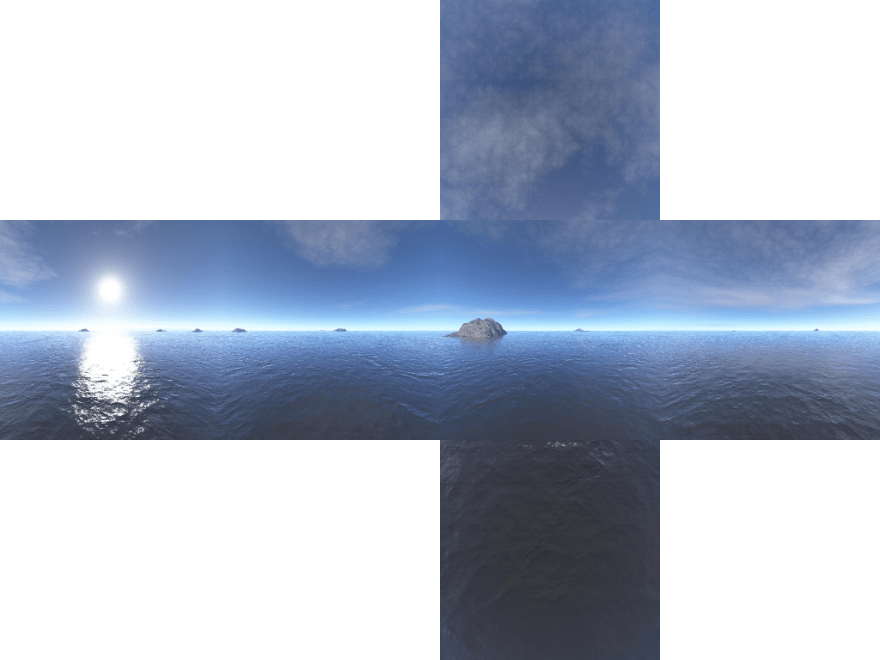

# COSC3000 Practical 4:
## Textures, Cubemaps and Reflections

This practical is all about adding detail to our scenes. It will cover the following topics:
- loading a texture
- drawing a skybox
- environmental sampling/reflections
- bonus: lighting

### 1: Loading a Texture
For completeness, this will be shown both in Pygame and GLFW, hopefully you'll see that the similarities outweigh the differences. Open up whichever folder you like and head to the Material class, the job of loading the file is prefilled, so let's focus on configuring the texture.\
In Material's initialiser:
```python
self.texture = glGenTextures(1)
glBindTexture(GL_TEXTURE_2D, self.texture)
```
Here we create the texture, then bind it as the TEXTURE_2D target.
```python
glTexParameteri(GL_TEXTURE_2D, GL_TEXTURE_WRAP_S, GL_REPEAT)
glTexParameteri(GL_TEXTURE_2D, GL_TEXTURE_WRAP_T, GL_REPEAT)
```
Next we configure the wrap modes, how the texture will behave when its texture coordinates go outside the range of (0,1).\
Repeat mode will simply continue into the next period of the texture. Other options include clamping to edge or clampling to border.
```python
glTexParameteri(
    GL_TEXTURE_2D, GL_TEXTURE_MIN_FILTER, GL_NEAREST_MIPMAP_LINEAR)
glTexParameteri(
    GL_TEXTURE_2D, GL_TEXTURE_MAG_FILTER, GL_LINEAR)
```
Then we set the minifying and magnifying filters. Then, after loading the image data from the file, we send it to the texture, and build mipmaps for it:
```python
glTexImage2D(
    GL_TEXTURE_2D, 0, GL_RGBA, 
    image_width, image_height,
    0, GL_RGBA, GL_UNSIGNED_BYTE, img_data
)
glGenerateMipmap(GL_TEXTURE_2D)
```
Using the shader is simple enough, just declare that we're sending to texture unit 0 (not strictly necessary, but a good safecheck), and bind the texture.\
In Material's use function:
```python
glActiveTexture(GL_TEXTURE0)
glBindTexture(GL_TEXTURE_2D,self.texture)
```
Now let's set up our shader so that it can use the texture. Nothing needs to change in our vertex shader, but it is good to double check:
```
#version 330 core

layout (location=0) in vec3 vertexPos;
layout (location=1) in vec2 vertexTexCoord;
layout (location=2) in vec3 vertexNormal;

uniform mat4 model;
uniform mat4 view;
uniform mat4 projection;

out vec2 fragmentTexCoord;

void main()
{
    gl_Position = projection * view * model * vec4(vertexPos, 1.0);
    fragmentTexCoord = vertexTexCoord;
}
```
Note that the normal vector is being consumed but not used, this is totally ok.\
\
In the fragment shader:
```
#version 330 core

in vec2 fragmentTexCoord;

uniform sampler2D imageTexture;

out vec4 color;

void main()
{
    color = texture(imageTexture, fragmentTexCoord);
}
```
Clean and Simple!

### 2: Cubemaps
2D Textures are all well and good, but we can actually do a little better. OpenGL also has a concept of a cubemap, six images are loaded into an image array, and then on sampling, a 3D direction vector is passed in. Under the hood OpenGL then does a simple intersection test and determines which cube face and which texel (texture pixel) on it is seen.\
(If it's of interest, the cube is virutally modelled around the origin having unit size, and the direction vector is virtually modelled originating from the origin)\
Let's use a cubemap texture to make a skybox! Sky textures can be found from various sources, and they'll often look something like this:\
</img>\
If you have Qt6 installed on your system (A free install, btw), and are working in Windows (unfortunately I wasn't able to get this one running in MacOS), I've included a simple GUI tool which will take an image and chop it into a configurable grid, allowing pixel perfect cubemaps (it works well for sprite sheets too.)\
Once you have a series of images chopped, we can make a cubemap texture and load them in.\
In MaterialCubemap's initializer:
```python
self.texture = glGenTextures(1)
glBindTexture(GL_TEXTURE_CUBE_MAP, self.texture)
```
We then load the images one by one, and send the data to appropriate regions of the cubemap texture. This part of the code is a little heavy, so see the implementation for reference. In particular because image transformations are sometimes needed to tune the cubemap just right.\
The basic idea is:
```python
with Image.open(f"{filepath}_left.png", mode = "r") as img:
    #process pretty similarly to loading an image for regular textures,
    #maybe apply some transformations.
    glTexImage2D(GL_TEXTURE_CUBE_MAP_NEGATIVE_Y,...)
with Image.open(f"{filepath}_right.png", mode = "r") as img:
    ...
    glTexImage2D(GL_TEXTURE_CUBE_MAP_POSITIVE_Y,...)
...
```
Binding the texture for use is pretty similar.\
In MaterialCubemap's use function:
```python
glActiveTexture(GL_TEXTURE0)
glBindTexture(GL_TEXTURE_CUBE_MAP, self.texture)
```
Now the question is: how do we use this to draw a sky? One approach is to draw a quadrilateral with the exact size of the screen, and to calculate a direction vector in world space for each pixel on the screen.\
Look at the center pixel of your screen, and think of your eyes as the camera, what's the direction vector for your eye to that center pixel? That's right! It's the camera's forwards direction! Now look at the pixel on the center-right of the screen, that is (1, 0) in NDC. Convince yourself that the world space direction vector is forwards + right.\
In this same theme, the world space direction vector for a camera looking at a certain 2D pixel on the screen is the linear combination:
```
rayDirection = cam_forwards + vertexPos.x * cam_right + vertexPos.y * cam_up;
```
And with that we have our vertex shader. In vertex_sky.txt:
```
#version 330 core

layout (location=0) in vec2 vertexPos;

uniform vec3 camera_forwards;
uniform vec3 camera_right;
uniform vec3 camera_up;

out vec3 rayDirection;

void main()
{
    gl_Position = vec4(vertexPos, 0.0, 1.0);
    rayDirection = camera_forwards + vertexPos.x * camera_right + vertexPos.y * camera_up;
}
```
The direction vector passed out by the vertex shader can then be used to sample from the cubemap. In fragment_sky.txt:
```
#version 330 core

in vec3 rayDirection;

uniform samplerCube imageTexture;

out vec4 color;

void main()
{
    color = texture(imageTexture, rayDirection);
}
```
We've loaded a series of files into a cubemap texture, and we have a shader which will sample from that cubemap. The final step is to draw everything. The idea is to draw the sky first, then draw everything else on top.\
In Renderer's render function:
```python
#refresh screen
glClear(GL_COLOR_BUFFER_BIT | GL_DEPTH_BUFFER_BIT)

#draw sky
glUseProgram(self.shaders[PIPELINE_SKY])
glDisable(GL_DEPTH_TEST)
self.materials[OBJECT_SKY].use()
glUniform3fv(
    self.cameraForwardsLocation, 1, camera.forwards)
glUniform3fv(
    self.cameraRightLocation, 1, camera.right)
glUniform3fv(
    self.cameraUpLocation, 1, 
    (self.screenHeight / self.screenWidth) * camera.up)
#(The scalar factor is to account for screen aspect ratio)
glBindVertexArray(self.meshes[OBJECT_SKY].vao)
glDrawArrays(
    GL_TRIANGLES, 
    0, self.meshes[OBJECT_SKY].vertex_count)

#Everything else
glUseProgram(self.shaders[PIPELINE_3D])
glEnable(GL_DEPTH_TEST)

...
```
And there we have it! It's pretty striking how this opens up our scene visually.
### 3: Reflections
Besides just making cool sky effects, cubemaps can be used in multiple shaders. The upshot of this is that we can pass the sky into our regular shader also, then use that for quick and easy refractions/reflections.\
The advantage of this is that it's incredibly fast, the downside is that it isn't a truly dynamic reflection. If you've ever used Unreal engine, you may notice that the default scene comes with a reflection capturer object, the purpose of this is to take a snapshot of the environment once and save that to a cubemap for quick reflections.\
But, back to the task at hand. How can we calculate a reflection? We need to pass a little more data to our shader, the fragment shader will need to know:
- where our fragment of interest is
- where the camera is
- what the normal vector of the fragment is
The fragment's position and normal can be passed along by the vertex shader:\
In vertex.txt:
```
#version 330 core

layout (location=0) in vec3 vertexPos;
layout (location=1) in vec2 vertexTexCoord;
layout (location=2) in vec3 vertexNormal;

uniform mat4 model;
uniform mat4 view;
uniform mat4 projection;

out vec2 fragmentTexCoord;
out vec3 fragmentNormal;
out vec3 fragmentPos;

void main()
{
    gl_Position = projection * view * model * vec4(vertexPos, 1.0);
    fragmentTexCoord = vertexTexCoord;
    fragmentNormal = vec3(model * vec4(vertexNormal, 0.0));
    fragmentPos = vec3(model * vec4(vertexPos, 1.0));
}
```
This can then be taken in by the fragment shader, as well as the camera's position (in the uniform block)\
In fragment.txt:
```
#version 330 core

in vec2 fragmentTexCoord;
in vec3 fragmentNormal;
in vec3 fragmentPos;

uniform samplerCube skyTexture;
uniform sampler2D imageTexture;
uniform vec3 viewerPos;

out vec4 color;

void main()
{
    vec3 viewerToFragment = normalize(fragmentPos - viewerPos);
    vec3 reflectedRayDirection = reflect(viewerToFragment, fragmentNormal);
    vec4 skyColor = texture(skyTexture, reflectedRayDirection);
    vec4 baseColor = texture(imageTexture, fragmentTexCoord);
    color = skyColor * baseColor;
}
```
Here we're using GLSL's inbuilt reflect function, which calculates the standard vector reflection of an incident direction about a normal. It's worth checking through the source code to see how this is supported on the CPU side. In particular, the make_shader function has changed a little, PyOpenGL's shader validation code sometimes throws unexpected errors.\
This is really just scratching the surface of the capabilities of textures and cubemaps, a lot of topics here can be extended for a more in depth project.