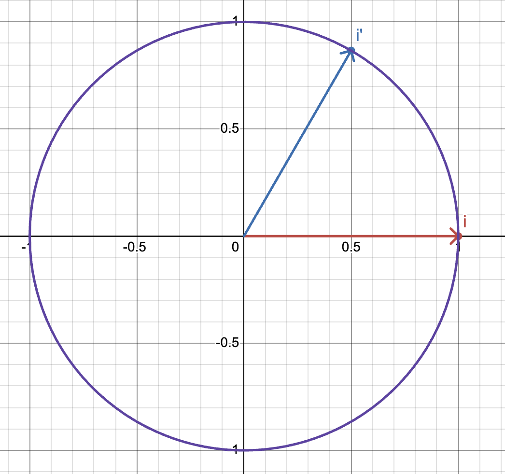

# Stage 4: Adding the player
In this stage we're going to add a player to the map, control them with the mouse and keyboard, and handle collisions.

## Map
Let's add a line to the map file to describe the player.

<level.txt>:
```
size 27 18
map
0 0 0 0 0 0 0 0 0 0 0 0 0 0 0 0 0 0 0 0 0 0 0 0 0 0 0 
0 0 0 0 0 0 0 0 0 0 0 0 0 0 0 0 0 0 0 0 0 0 0 0 0 0 0 
0 0 0 0 0 0 0 0 0 0 0 0 0 0 0 0 0 0 0 0 0 2 2 2 2 0 0 
0 0 3 3 3 3 3 3 3 3 0 0 0 0 0 0 0 0 0 0 2 0 0 0 0 2 0 
0 0 3 0 0 0 0 0 0 3 0 0 0 0 0 0 0 0 0 2 0 0 0 0 0 0 2 
0 0 3 0 0 0 0 0 0 3 0 0 0 0 0 0 0 0 2 0 0 0 0 0 0 0 2 
0 0 3 0 0 6 6 0 0 3 2 2 2 2 2 2 2 2 0 0 0 0 0 0 0 0 2 
0 0 3 0 0 6 6 0 0 0 0 0 0 0 0 0 0 0 0 0 0 0 0 0 0 0 2 
0 0 3 0 0 0 0 0 0 3 2 0 2 2 2 2 2 2 0 0 0 0 0 0 0 0 2 
0 0 3 0 0 0 0 0 3 0 2 0 2 0 0 0 0 0 2 0 0 0 0 0 0 0 2 
0 0 3 0 0 0 0 0 3 0 2 0 2 0 0 0 0 0 0 2 0 0 0 0 0 0 2 
0 0 3 3 3 3 3 3 3 0 1 0 1 0 0 0 0 0 0 0 2 0 0 0 0 2 0 
0 0 0 0 0 0 0 0 0 1 0 0 0 1 0 0 0 0 0 0 0 2 2 2 2 0 0 
0 0 0 0 0 0 0 0 0 1 0 0 0 1 0 0 0 0 0 0 0 0 0 0 0 0 0 
0 0 0 0 0 0 0 0 0 1 0 0 0 1 0 0 0 0 0 0 0 0 0 0 0 0 0 
0 0 0 0 0 0 0 0 0 1 0 0 0 1 0 0 0 0 0 0 0 0 0 0 0 0 0 
0 0 0 0 0 0 0 0 0 1 0 0 0 1 0 0 0 0 0 0 0 0 0 0 0 0 0 
0 0 0 0 0 0 0 0 0 0 1 1 1 0 0 0 0 0 0 0 0 0 0 0 0 0 0 
end
player 11 15
```
Then let's adjust the game class to load in the player.

<controller/game.py>:
```
def load_map(self, filename: str) -> None:

    with open(filename, "r") as file:
        line = file.readline()

        while line:
            
            # ...

            if words[0] == "player":
                self.player = self.make_player(words)
            
            line = file.readline()

def make_player(self, words: list[str]) -> np.ndarray:
        
    x = int(words[1])
    y = int(words[2])
    return np.array((x,y), dtype = np.float32)
```

Since we've now got two major bits of data, it might make a little more sense to store the map and player data directly in the game class, rather than passing data around a lot.

## Displaying the player
Let's go to the renderer and store the player data.

<systems/renderer.py>:
```
class Renderer:

    def __init__(self, width: int, height: int, 
                 game_map: np.ndarray, player: np.ndarray):

        # ...

        self.states = (
            GameRenderer(width, height, game_map, colors, self.screen_pixels, player),
            MapRenderer(width, height, game_map, colors, self.screen_pixels, player)
        )
        # ...
    
    # ...

class GameRenderer:

    def __init__(self, width: int, height: int, 
                 game_map: np.ndarray, colors: tuple[int], 
                 screen_pixels: np.ndarray,
                 player: np.ndarray):

        # ...
        self.player = player
    
    # ...

class MapRenderer:

    def __init__(self, width: int, height: int, 
                 game_map: np.ndarray, colors: tuple[int], 
                 screen_pixels: np.ndarray, player: np.ndarray):

        # ...
        
        self.player = player
        
    # ...
```

The player can be drawn as a small white rectangle.
```
def update(self):

    clear_screen(self.screen_pixels, self.colors[0])

    # player
    color = self.colors[1]
    size = (8, 8)
    top_left = (
        int(self.player[0] * self.grid_size[0] - 4), 
        int(self.player[1] * self.grid_size[1] - 4))
    draw_rectangle(self.screen_pixels, color, top_left, size)

    # ...
```

## Rotating Points
You may notice that so far we haven't touched any player movement. Before we look at that, we'll need to learn how to rotate points around the origin. Here's the formula for rotating a point around the origin by a given angle:
```
x_new = x_old * cos(theta) + y_old * sin(theta)
y_new = -x_old * sin(theta) + y_old * cos(theta)
```

Pretty confusing, right? I remember as a kid excitedly printing out source code for a fairly DIY 3D engine only to stare at this formula in a daze. The problem is that equations like this are easy to share around, without linking to the original concept which produced them. Let's learn about where this formula comes from.

A general transformation of a point is a formula which consumes some original data and produces some new data. The most general possible description is simply a combination of all available data:
```
x_new = a * x_old + b * y_old
y_new = c * x_old + d * y_old
```
If you're familiar with linear algebra, this can be written as a matrix-vector multiplication. And if you're not familiar with linear algebra, get on that. no excuses.

$$p_{new} = Tp_{old}$$
$$\left(\begin{array}{c}
    x_{new} \\
    y_{new}
\end{array}\right) = \left(\begin{array}{cc}
    a & b \\
    c & d \\
  \end{array}
\right) \left(\begin{array}{c}
    x_{old} \\
    y_{old}
\end{array}\right)$$

Combinations of coefficients can describe rotation, scale or skew transformations. The big question is, given a transformation, how to we determine the coefficients? The answer is surprisingly elegant, we analyse what happens to the standard basis vectors:
$$\underset{\sim}{i} = \left(\begin{array}{c}
    1 \\
    0
\end{array}\right),\quad \underset{\sim}{j} = \left(\begin{array}{c}
    0 \\
    1
\end{array}\right)$$
Why? Well let's say that an unknown matrix, T maps the basis vectors to some (known) new vectors, then if we write out the transformation matrices we have:
$$\underset{\sim}{i}' = T\underset{\sim}{i},\quad \underset{\sim}{j}' = T\underset{\sim}{j}$$
$$\left(\underset{\sim}{i}' | \underset{\sim}{j}' \right) = T\left(\underset{\sim}{i} | \underset{\sim}{j}\right) = T\left(\begin{array}{cc}
    1 & 0 \\
    0 & 1 \\
  \end{array}
\right) = TI = T$$
So the transformation matrix can be formed by concatenating the images of the basis vectors i & j. The same principle applies to higher dimensions.

Let's look at the basis vectors under rotation, we'll start with i.

Here we can see that i undergoes the mapping
$$\underset{\sim}{i} = \left(\begin{array}{c}
    1 \\
    0
\end{array}\right) \rightarrow \left(\begin{array}{c}
    \cos\left(\theta\right) \\
    \sin\left(\theta\right)
\end{array}\right) = \underset{\sim}{i}'$$

Now investigating j gives us:

$$\underset{\sim}{j} = \left(\begin{array}{c}
    0 \\
    1
\end{array}\right) \rightarrow \left(\begin{array}{c}
    -\sin\left(\theta\right) \\
    \cos\left(\theta\right)
\end{array}\right) = \underset{\sim}{j}'$$

And hence the images of the basis vectors give us the rotation transform:
$$T = \left(\underset{\sim}{i}' | \underset{\sim}{j}' \right) = \left(\begin{array}{cc}
    \cos\left(\theta\right) & -\sin\left(\theta\right) \\
    \sin\left(\theta\right) & \cos\left(\theta\right) \\
  \end{array}
\right)$$

This is the transformation matrix which produces the formula! Now if we imagine our player sitting around in the world with no rotation, they would look something like this:

This is our frame of reference, we will want to compute the player's actual forwards and right vectors by rotating this original data according to the player's angle. But that's enough theory for now, let's get back to coding.

## Player Direction
Let's add an angle to our player specification.

<level.txt>:
```
size 27 18
map
...
end
player 11 15 0
```

Now in addition to position, let's store the player angle.
<controller/game.py>:
```
def make_player(self, words: list[str]) -> np.ndarray:
        
    x = int(words[1])
    y = int(words[2])
    theta = float(words[3])
    return np.array((x,y,theta), dtype = np.float32)
```
We're bundling all the data together here rather than making a player class. This is a personal choice, I like classes for high level control but find them unnecessary for simple data storage.

Now let's write a function to draw lines.
<systems/renderer.py>:
```
@njit()
def line_dda(color_buffer: np.ndarray, 
             x1: int, y1: int, x2: int, y2: int, 
             color: int) -> None:
    
    dx = int32(x2 - x1)
    dy = int32(y2 - y1)
    
    steps = max(np.abs(dx), np.abs(dy))
```

First we find the horizontal and vertical components of the line segment. Whichever components has the greater size is considered the dominant component, this will be used for stepping along and drawing the line segment, so that points aren't skipped.
```
@njit()
def line_dda(color_buffer: np.ndarray, 
             x1: int, y1: int, x2: int, y2: int, 
             color: int) -> None:
    
    # ...

    x_increment = float32(dx / steps)
    y_increment = float32(dy / steps)
```

We then get the increment for each direction. Dividing by the dominant step size ensures both increments are less than or equal to 1, so points don't get skipped.

```
@njit()
def line_dda(color_buffer: np.ndarray, 
             x1: int, y1: int, x2: int, y2: int, 
             color: int) -> None:
    
    dx = int32(x2 - x1)
    dy = int32(y2 - y1)
    
    steps = max(np.abs(dx), np.abs(dy))

    x_increment = float32(dx / steps)
    y_increment = float32(dy / steps)

    x = x1
    y = y1
    for _ in range(steps):
        color_buffer[x][y] = color
        x += x_increment
        y += y_increment
```

And then we start stepping! We start at the (x1,y1) position and use the increments to step forwards towards (x2,y2). This isn't the most optimal general line drawing function, but the session is already getting quite long and these lines will just be for debugging anyway.

Now let's draw the forwards and right vectors.
```
class MapRenderer:

    # ...
        
    def update(self):

        # draw everything else (so vectors are visible over grid)
        
        # forwards
        x1 = self.player[0] * self.grid_size[0]
        y1 = self.player[1] * self.grid_size[1]
        x2 = self.player[0] * self.grid_size[0] + 16
        y2 = self.player[1] * self.grid_size[1]
        color = self.colors[6]
        line_dda(self.screen_pixels, x1, y1, x2, y2, color)

        # right
        x2 = self.player[0] * self.grid_size[0]
        y2 = self.player[1] * self.grid_size[1] - 16
        color = self.colors[7]
        line_dda(self.screen_pixels, x1, y1, x2, y2, color)
```

The right vector may look reversed compared to the diagram, this is caused by pygame's coordinate system but isn't much of a problem.

Now let's change the angle to something nonzero.

<level.txt>
```
size 27 18
map
...
end
player 11 15 60
```

Make a function to rotate a direction

<systems/renderer.py>:
```
@njit()
def rotate(x: float, y: float, theta: float) -> tuple[float]:
    
    t = np.radians(theta)
    c = np.cos(t)
    s = np.sin(t)

    x_new =  x * c + y * s
    y_new = -x * s + y * c
    
    return (x_new, y_new)
```

And use it to draw the player's rotated vectors:
```
# forwards
x1 = self.player[0] * self.grid_size[0]
y1 = self.player[1] * self.grid_size[1]
forwards_x, forwards_y = rotate(16, 0, self.player[2])
x2 = self.player[0] * self.grid_size[0] + forwards_x
y2 = self.player[1] * self.grid_size[1] + forwards_y
color = self.colors[6]
line_dda(self.screen_pixels, x1, y1, x2, y2, color)

# right
right_x, right_y = rotate(0, -16, self.player[2])
x2 = self.player[0] * self.grid_size[0] + right_x
y2 = self.player[1] * self.grid_size[1] + right_y
color = self.colors[7]
line_dda(self.screen_pixels, x1, y1, x2, y2, color)
```

## Controlling the player
We're almost done for today, but wouldn't it be nice to add keyboard and mouse controls? First of all, let's take that rotation function and move it to the config file, so that multiple modules can use it.

Now let's write a function to handle the current state of keypresses. The idea is to add or subtract the forwards and right vectors based on which keys are currently pressed.

<controller/game.py>:
```
def handle_keys(self) -> None:

    forwards_x, forwards_y = rotate(1, 0, self.player[2])
    right_x, right_y = rotate(0, -1, self.player[2])

    keys = pg.key.get_pressed()
    speed = 0.05
    
    if keys[pg.K_a]:
        self.player[0] -= speed * right_x
        self.player[1] -= speed * right_y
    if keys[pg.K_d]:
        self.player[0] += speed * right_x
        self.player[1] += speed * right_y
    if keys[pg.K_w]:
        self.player[0] += speed * forwards_x
        self.player[1] += speed * forwards_y
    if keys[pg.K_s]:
        self.player[0] -= speed * forwards_x
        self.player[1] -= speed * forwards_y
```

This can be called every frame:
```
while (running):
    #events
    # ...
    
    self.handle_keys()
    
    self.renderer.update()

    # ...
```

The most important thing to check here is that w moves use in the direction of the forwards vector, s away, and the same for d and a with regard to the right vector.

This more or less works, but there are some issues.

## Movement speed
We can tweak the speed parameter to suit our system, but this isn't very portable. It would be better to adjust movement speed based on the time interval between updates. Luckily our game is already calculating its framerate, we can use this to find the frametime in milliseconds.
```
def play(self):

    # ...
    self.frametime = 0.0
    while (running):
        
        # ...

        #timing
        self.clock.tick()
        framerate = int(self.clock.get_fps())
        self.frametime = 1000.0 / max(framerate, 1.0)
        pg.display.set_caption(f"Running at {framerate} fps.")
    
    self.quit()
```

For a game running at 60 frames per second, about 16.666 milliseconds pass per update. This can be used to give a correction factor, so faster updates will not change the position as by much.
```
speed = 0.05 * self.frametime / 16.67
```
This gives us a nice smooth movement.

## Collision detection
We're walking through walls! Let's solve this with a "look ahead" update. Before moving, we test to see if the move is possible.

First, let's check if the position on the map is free:
```
def can_move(self, x: float, y: float, dx: float, dy: float) -> bool:

    x_test = int(x + dx)
    y_test = int(y + dy)

    return self.map[x_test][y_test] == 0
```

Then we can use the key state to set the net velocity before testing. By testing each component of velocity individually, we can slide along walls.
```
def handle_keys(self) -> None:

    forwards_x, forwards_y = rotate(1, 0, self.player[2])
    right_x, right_y = rotate(0, -1, self.player[2])
    velocity_x = 0.0
    velocity_y = 0.0

    keys = pg.key.get_pressed()
    speed = 0.05 * self.frametime / 16.67
    
    if keys[pg.K_a]:
        velocity_x -= speed * right_x
        velocity_y -= speed * right_y
    if keys[pg.K_d]:
        velocity_x += speed * right_x
        velocity_y += speed * right_y
    if keys[pg.K_w]:
        velocity_x += speed * forwards_x
        velocity_y += speed * forwards_y
    if keys[pg.K_s]:
        velocity_x -= speed * forwards_x
        velocity_y -= speed * forwards_y
    
    if self.can_move(self.player[0], self.player[1], velocity_x, 0.0):
        self.player[0] += velocity_x
    
    if self.can_move(self.player[0], self.player[1], 0.0, velocity_y):
        self.player[1] += velocity_y
```

This is pretty good, but our player's still getting very close to the walls. We can mitigate this by looking further ahead.
```
magnitude = np.sqrt(velocity_x * velocity_x + velocity_y * velocity_y)

if magnitude == 0:
    return

dx = 0.25 * velocity_x / magnitude
dy = 0.25 * velocity_y / magnitude

if self.can_move(self.player[0], self.player[1], dx, 0.0):
    self.player[0] += velocity_x

if self.can_move(self.player[0], self.player[1], 0.0, dy):
    self.player[1] += velocity_y
```

## Mouse Controls
The basic idea of mouse movement is to track how far the mouse has moved each frame. There are a few ways to do this but my favourite is to continually fix the mouse to the center of the screen.

Let's tell pygame not to display the mouse.
```
class Game:
    """
        Calls high level control functions (handle input, draw scene etc)
    """

    def __init__(self):

        # ...

        pg.mouse.set_visible(False)
```

Now that the mouse is fixed and invisible, the user can't press x to close the window. Let's close instead when they press the escape key.
```
def play(self):

    # ...

    while (running):
        #events
        for event in pg.event.get():

            if (event.type == pg.KEYDOWN):
                if (event.key == pg.K_TAB):
                    self.renderer.toggle_draw_mode()
                if (event.key == pg.K_ESCAPE):
                    running = False
        
        # ...
```

Finally we can write a mouse handling function.

```
def handle_mouse(self) -> None:
        
    current_pos = pg.mouse.get_pos()
    speed = 0.1

    dx = current_pos[0] - self.screen_width / 2
```

We measure our mouse's displacement from the center of the screen. Pygame reports mouse coordinates as integers, so we'll only reset the mouse if a movement has been detected. This is important because in reality the mouse can move fractions of a pixel and reseting every frame can stop it from actually registering any movement at all.

```
def handle_mouse(self) -> None:
        
    # ...

    if abs(dx) > 0:

        self.player[2] += speed * dx
        if self.player[2] > 360:
            self.player[2] -= 360
        if self.player[2] < 0:
            self.player[2] += 360
        
        pg.mouse.set_pos(self.screen_width / 2, self.screen_height / 2)
```

If the mouse has moved at least a full pixel, we update the player's direction and then reset the cursor to the center of the screen.

And that's it! This was a pretty long session, but we finally have a good foundation to work with. Over the next two sessions we'll look at the raycasting algorithm.