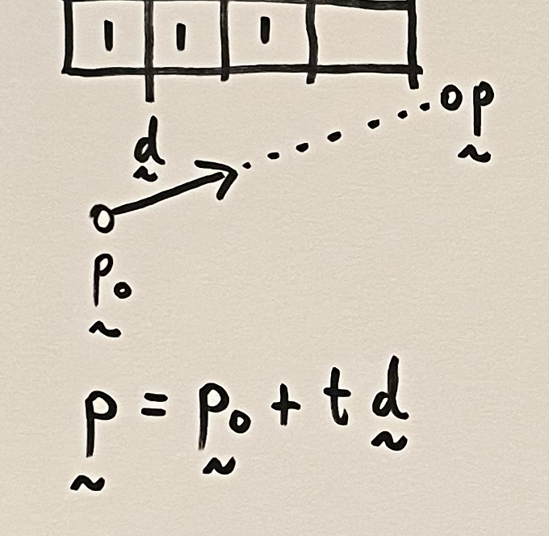
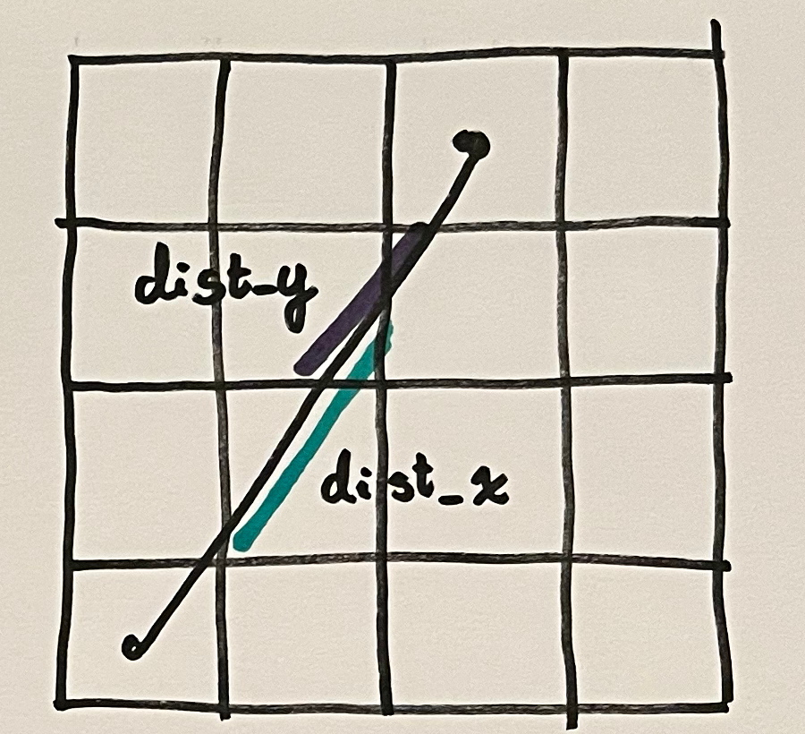
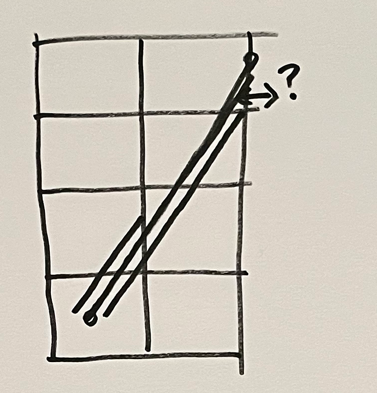

# Stage 5: The Raycasting Algorithm
Now let's look at the raycasting algorithm. We won't worry about 3D rendering yet, as there's a lot of benefit to just understanding the algorithm itself.

## The Task
One of the challenges of raycasting is that it's such a simple idea in theory. We have a 2D array, zeros represent empty space and any other number represents a wall. We look from the player's position and step forwards until we hit a wall.


Also, to help us we have the line equation. It basically states that we start at some position, and then look out from there in some direction.



So then this idea of "stepping forward" basically involves slowly increasing the value of t until the ray position is sampling a wall. But the devil's in the details, if we take large steps, we risk completely missing walls. On the other hand, if we take smaller steps, we can waste a lot of time walking through empty space.


## How Far to Step?

In this stage we'll solve this problem by using an adaptive step size method, called Digital Differential Analyis, or DDA for short. If we look at the image above, starting at the player's position, the ray is travelling to the right and upwards. At every step we must decide whether to step forwards far enough to move us one grid square to the right, or far enough to move us one grid square updwards. How do we decide this? We take whichever of those two steps is smaller. 

In order to make these sorts of decisions we need to know how far forwards a step will take us.



Here, dist_x is the forwards distance along the ray necessary to change the ray's x coordinate by 1, and likewise for dist_y. Calculation of these quantities can be made by similarity of triangles.


The top left triangle represents a ray in its natural environment. The ray's direction has some length and can decompose into components. The hypotenuse of the triangle represents how far the ray will step forward, so by dividing all sides we can solve for the case where we step forwards by 1 in the x or y axis. Since both expressions have a common factor, and these distances are used as decision parameters, we can divide out the common factor to simplify things. We also deal just with absolute values, since it's distances we're interested in.

## Initial conditions
These parameters are fine once the ray is locked onto the grid, but what about its starting position? Turns out this is fairly straightforward once we know dist_x and dist_y. The player starts some fraction of a grid space away from the grid lines, we just need to calculate how far the ray will need to step forward to get to the next x or y gridline (in the direction they're looking).


## The Algorithm


Here's the basic algorithm! You might be noting that along the way we're tracking two distances, why is this necessary? Basically, decisions are based on whole grid steps. If a whole y step takes a ray partway across in x, then it's hard to make a proper x decision from that point.



## Coding it up
Today we looked at the underlying logic of the algorithm, but we can still code something to show it in practice. Let's say we want our top down view to show a single raycast along our forwards vector.

First we'll get the player's position on the grid.

<level.txt>:
```
class MapRenderer:

    # ...
        
    def update(self):

        clear_screen(self.screen_pixels, self.colors[0])

        # trace
        map_x = int(self.player[0])
        map_y = int(self.player[1])
```

Then we'll get the components of the ray's direction. In this case the ray will be looking along the player's forwards vector. Once we have the components we can calculate dist_x and dist_y.

```
# trace
map_x = int(self.player[0])
map_y = int(self.player[1])

dx, dy = rotate(1, 0, self.player[2])
dist_x = 1 / abs(dx)
dist_y = 1 / abs(dy)
```

We then calculate the ray's initial distances. step_x and step_y are the increments to be applied to the ray, so rays can step to the left or right, up or down appropriately.
```
# trace
map_x = int(self.player[0])
map_y = int(self.player[1])

dx, dy = rotate(1, 0, self.player[2])
dist_x = 1 / abs(dx)
dist_y = 1 / abs(dy)
        
proportion_from_left = self.player[0] - map_x
t_x = proportion_from_left * dist_x if dx < 0 else (1.0 - proportion_from_left) * dist_x
step_x = int(np.sign(dx))

proportion_from_bottom = self.player[1] - map_y
t_y = proportion_from_bottom * dist_y if dy < 0 else (1.0 - proportion_from_bottom) * dist_y
step_y = int(np.sign(dy))
```
To test the method we can draw the player's current position.
```
# trace
map_x = int(self.player[0])
map_y = int(self.player[1])

dx, dy = rotate(1, 0, self.player[2])
dist_x = 1 / abs(dx)
dist_y = 1 / abs(dy)
        
proportion_from_left = self.player[0] - map_x
t_x = proportion_from_left * dist_x if dx < 0 else (1.0 - proportion_from_left) * dist_x
step_x = int(np.sign(dx))

proportion_from_bottom = self.player[1] - map_y
t_y = proportion_from_bottom * dist_y if dy < 0 else (1.0 - proportion_from_bottom) * dist_y
step_y = int(np.sign(dy))

# draw current square
color = self.colors[3]
top_left = (map_x * self.grid_size[0], map_y * self.grid_size[1])
draw_rectangle(self.screen_pixels, color, top_left, self.grid_size)
```
Finally we can start stepping the ray forwards, stopping when we hit a wall.

```
# trace
map_x = int(self.player[0])
map_y = int(self.player[1])

dx, dy = rotate(1, 0, self.player[2])
dist_x = 1 / abs(dx)
dist_y = 1 / abs(dy)
        
proportion_from_left = self.player[0] - map_x
t_x = proportion_from_left * dist_x if dx < 0 else (1.0 - proportion_from_left) * dist_x
step_x = int(np.sign(dx))

proportion_from_bottom = self.player[1] - map_y
t_y = proportion_from_bottom * dist_y if dy < 0 else (1.0 - proportion_from_bottom) * dist_y
step_y = int(np.sign(dy))

while self.map[map_x][map_y] == 0:

    # draw current square
    color = self.colors[3]
    top_left = (map_x * self.grid_size[0], map_y * self.grid_size[1])
    draw_rectangle(self.screen_pixels, color, top_left, self.grid_size)

    # step forwards
    if t_x < t_y:
        t_x += dist_x
        map_x += step_x
    else:
        t_y += dist_y
        map_y += step_y

# player
# ...
```

And that's it! In the next stage we'll apply this on a larger scale to render a 3D view of the world.